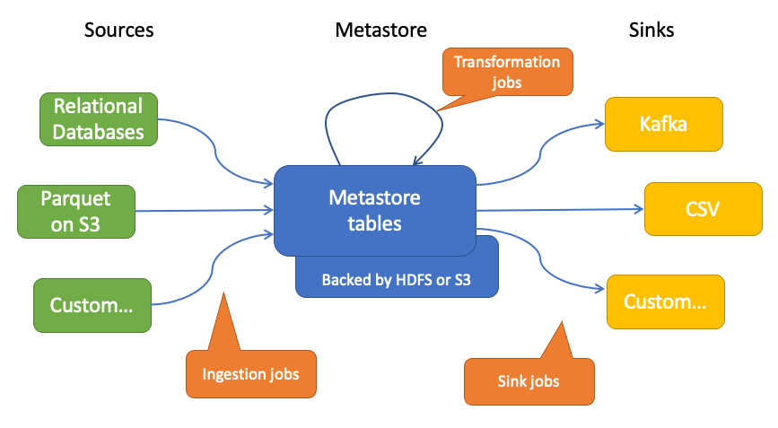
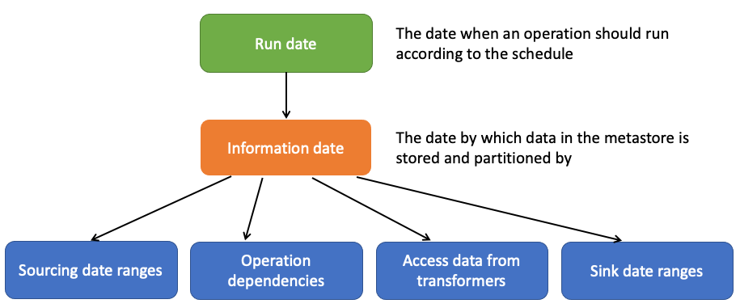
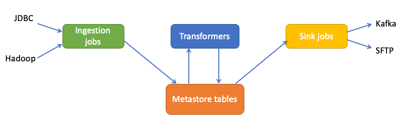
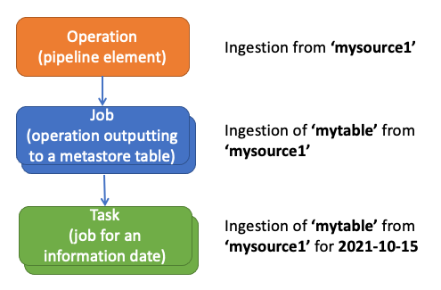
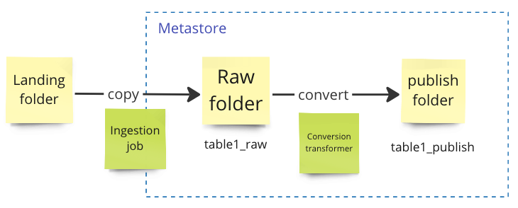
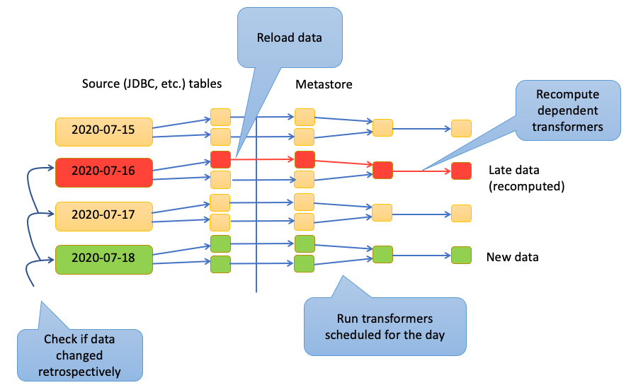

# About Pramen
[](https://github.com/AbsaOSS/pramen/actions)
[](https://github.com/AbsaOSS/pramen/actions)
[](https://app.fossa.com/projects/custom%2B24661%2Fgithub.com%2FAbsaOSS%2Fpramen)
[](https://mvnrepository.com/artifact/za.co.absa.pramen/pramen-api)
[](https://badge.fury.io/py/pramen-py)


Pramen is a framework for defining data pipelines based on Spark and a configuration driven tool to run and
coordinate those pipelines. The project focuses around Hadoop and Spark, but can run arbitrary jobs.

The idea behind Pramen pipelines is simple. A pipeline consists of
* _Sources_ are the data systems that are not managed by the pipeline. An example could be an operational relational database.
  - Ingestion jobs are used to get data from external systems into the metastore.
* _Metastore_ is the data storage managed by the pipeline. Data in the metastore is accessed by table names.
  The metastore hides the underlying storage and format, which is usually Parquet or Delta on HDFS or S3.
  - Transformation jobs are used to transform data from the metastore and save the results back to the metastore.
    Transformers can be written in Scala or in Python.
* _Sinks_ are targets to send data from the metastore. An example could be a Kafka cluster or a CSV file in a local folder.
  - Sink jobs are used to send data from the metastore to sinks

The architecture is customizable, so you can define your own sources, transformers and sinks and deploy it independently
from the framework.



With Pramen you can:
* Build a data lake for tabular data.
  - Define ingestion jobs to get data from external data sources to HDFS or S3.
  - Organize data by partitioning it according to event or snapshot date.
* Create ETL data pipelines
  - Define ingestion jobs to _extract_ data from external sources to the metastore.
  - Use transformers _transform_ data inside the metastore.
  - Use sinks to _load_ data from the metastore to the target system.
* Create ML pipelines
  - Define ingestion jobs to get raw data to the metastore.
  - Use transformers to clean, aggregate and extract features from the raw data  in the metastore.
  - Use sinks to train and deploy models or to send data from the metastore to target systems.

There are many other data pipeline management tools. Why you would want to use Pramen?

* Declarative pipeline definitions
  - You define dependencies for transformers and Pramen will resolve them for you making sure a transformation
    runs only when all dependencies are satisfied.
* Auto-healing as much as possible
  - Keeping pipeline state allows quicker recovery from a faulty source or transformation since the framework will
    automatically determine which jobs to run. Jobs that already succeeded won't run again by default.
  - Handling of late data and retrospective updates to data in data sources by re-running dependent jobs.
  - Handling of schema changes from data sources.
* Functional design
  - The discipline on restricting mutable operations allows re-playable deterministic pipelines.
  - Easier to test individual transformers.
* Language support
  - You can use Scala and Python transformers and combine them.
* Extendable
  - If your data source or sink is not supported by Pramen yet? You can implement your own very easy.
* Built-in support of various relational database sources
  - Pramen already supports getting data from the following RDMS: PostgreSQL, MySql, Oracle Data Warehouse, Microsoft SQL Server,
    Denodo Virtualized and other standard JDBC compliant data sources 
    
# Typical Use Case and Benefits

Many environments still have numerous heterogeneous data sources that aren't integrated into a central data lake environment.

Pramen provides the ability to ingest and manage data pipelines en-masse from sourcing to producing.

Pramen assists with simplifying the efforts of ingestion and orchestration to a "no/low-code" level:
 - Automatic data loading and recovery (including missed and late data sources)
 - Automatic data reloading (partial or incorrect data load)
 - Automatic orchestration and coordination of dependant jobs (re-run downstream Pramen jobs automatically when upstream jobs are re-executed)

In addition to basic error notification, typical operational warnings are generated through email notifications such as:
 - Changes to upstream schema (unexpected changes to source data schemas) 
 - Sourcing performance thresholds (unexpected slower than expected data throughput)

**With Pramen data engineers and data scientists may focus on development and worry less about monitoring and maintaining existing data and machine learning pipelines.**

# Quick start

1. Get Pramen pipeline runner:

2. You can download Pramen from GitHub releases: [Pramen Releases](https://github.com/AbsaOSS/pramen/releases)

   Or you can build it from source for your Spark environment by running:
   ```sh
   git clone https://github.com/AbsaOSS/pramen
   cd pramen
   sbt -DSPARK_VERSION="3.3.2" ++2.12.18 assembly 
   ```
   (You need JDK 1.8 installed to run this)
 
   You can specify your Spark path and run the full end to end example from (Linux or Mac only): [pramen/examples/combined_example.sh](pramen/examples/combined_example.sh) 

   For all possible build options look see [Building Pramen to suite your environment](#building-pramen-to-suite-your-environment)

2. Define an ingestion pipeline

   Paste the contents of [ingestion_pipeline.conf](pramen/examples/ingestion_pipeline/ingestion_pipeline.conf)
   to a local file.

3. Run the pipeline. Depending on the environment the command may vary. Here is an example for Yarn:
   ```sh
   spark-submit --master yarn \
     --deploy-mode client \
     --num-executors 1 \
     --driver-memory 2g \
     --executor-memory 2g \
     --class za.co.absa.pramen.runner.PipelineRunner \
     pipeline-runner-0.12.10.jar \
     --workflow ingestion_pipeline.conf \
     --rerun 2022-01-01
   ```

# Building the project

Pramen is built using SBT.

## Project structure
Pramen consists of a few components:
- `pramen-api` - contains traits (interfaces) for defining custom transformations, sources and sinks. 
- `pramen-core` - contains the orchestration and run logic.
- `pramen-extras` - contains additional sources and sinks that are not part of the core since they add many additional
  dependencies.

A Pramen's data pipeline runs on a Spark cluster (standalone, Yarn, EMR, Databricks, etc). API and core are provided as
libraries to link. Usually to define data pipeline components all you need link is the API. Running a pipeline requires
creating an uber jar containing all the dependencies. 

## Linking

In order to implement custom sources, transformers and sinks you need to link Pramen API, and sometimes, the core.
Pramen libraries are available at [Maven Central (API)](https://mvnrepository.com/artifact/za.co.absa.pramen/pramen-api)
and [Maven Central (framework)](https://mvnrepository.com/artifact/za.co.absa.pramen/pramen-core)

You can link against Pramen to build your transformers in Scala at the following coordinates:

API (for defining custom sources, transformers, and sinks):
<table>
<tr><th>Scala 2.11</th><th>Scala 2.12</th><th>Scala 2.13</th></tr>
<tr>
<td align="center">
<a href = "https://maven-badges.herokuapp.com/maven-central/za.co.absa.pramen/pramen-api_2.11"></a><br>
</td>
<td align="center">
<a href = "https://maven-badges.herokuapp.com/maven-central/za.co.absa.pramen/pramen-api_2.12"></a><br>
</td>
<td align="center">
<a href = "https://maven-badges.herokuapp.com/maven-central/za.co.absa.pramen/pramen-api_2.13"></a><br>
</td>
</tr>
</table>

Framework core (for advanced usage):
<table>
<tr><th>Scala 2.11</th><th>Scala 2.12</th><th>Scala 2.13</th></tr>
<tr>
<td align="center">
<a href = "https://maven-badges.herokuapp.com/maven-central/za.co.absa.pramen/pramen-core_2.11"></a><br>
</td>
<td align="center">
<a href = "https://maven-badges.herokuapp.com/maven-central/za.co.absa.pramen/pramen-core_2.12"></a><br>
</td>
<td align="center">
<a href = "https://maven-badges.herokuapp.com/maven-central/za.co.absa.pramen/pramen-core_2.13"></a><br>
</td>
</tr>
</table>

The following Scala and Spark combinations are supported:

| Scala version | Spark version |
|:-------------:|:-------------:|
|     2.11      |     2.4.8     |
|     2.12      | 3.0 and above |
|     2.13      | 3.2 and above |

Pramen for Python transformers ia available in PyPi: [](https://badge.fury.io/py/pramen-py)

## Getting Pramen runner for your environment

Pramen is released as a set of thin JAR libraries. When running on a specific environment you might want to include all
dependencies in an uber jar that you can build for your Scala version. You can do that by either 
- Downloading pre-compiled version of Pramen runners at the [Releases](https://github.com/AbsaOSS/pramen/releases) section of the project.
- Or by building Pramen from source and creating an uber JAR file that contains all dependencies required to run the pipeline on a Spark cluster (see below).

### Building a Pramen runner JAR from sources

Creating an uber jar for Pramen is very easy. Just clone the repository and run one of the following commands:
```sh
sbt ++2.11.12 assembly 
sbt ++2.12.18 assembly
sbt ++2.13.12 assembly
```

You can collect the uber jar of Pramen either at
- `core/target/scala-2.x/` for the pipeline runner.
- `extras/target/scala-2.x/` for extra pipeline elements.

Since `1.7.0` Pramen runner bundle does not include Delta Lake format classes since they are most often available in 
Spark distributions. This makes the runner independent of Spark version. But if you want to include Delta Lake files
in your bundle, use one of example commands specifying your Spark version:
```sh
sbt -DSPARK_VERSION="2.4.8" -Dassembly.features="includeDelta" ++2.11.12 assembly 
sbt -DSPARK_VERSION="3.3.3" -Dassembly.features="includeDelta" ++2.12.18 assembly
sbt -DSPARK_VERSION="3.4.1" -Dassembly.features="includeDelta" ++2.13.12 assembly
```

Then, run `spark-shell` or `spark-submit` adding the fat jar as the option.
```sh
$ spark-shell --jars pramen-runner_2.12-1.7.5-SNAPSHOT.jar
```

# Creating a data pipeline

Pramen is a configuration driven tool. There are plenty of ways you can customize your pipeline. For the definitive set
of possible options please loot at [reference.conf](pramen/core/src/main/resources/reference.conf).

Let's take a look on components of a data pipeline in more detail.

## Pipeline components

A pipeline consists of _sources_, _the metastore_ and _sinks_.

Currently there are 3 types of jobs:
- _Ingestion_ jobs to get data from external sources to the metastore.
- _Transformation jobs_ to transform data inside the metastore.
- _Sink_ jobs to send data from the metastore to external systems.

### Dates
Before diving into pipeline definition it is important to understand how dates are handled. Pramen is a batch data
pipeline manager for input data updates coming from applications which are usually referred to as _source systems_. Pramen is designed
for updates coming from source systems daily or less frequently (weekly, monthly, etc). While it is possible to setup
pipelines in which data is updates several times a day, say, hourly, it might be more complicated since the design
targets daily or less frequent batch jobs.

Daily batch jobs usually process data generated by a source system on the previous day, also known as 'T+1' data processing,
meaning that the pipeline processes data at the state of the end of a day T is processed at the day T+1.

Data coming from source systems are usually classified as _entities_ and _events_. An entity type of data contains current
state of an application, or a snapshot. An event type of data contains a change in state of an application, such as bank 
transactions, for example. In both cases input data is stored in a batch-processing-friendly storage that supports
partitioning by a set of columns for performance. Pramen partitions data by the _information date_ which is a generalized
concept that unifies snapshot date for entities and event date for events. Information date of data is then used to define
transformations, dependencies etc.

In order to infer information dates a _run date_ is used. A run date is the date the job is scheduled to run.
For example, for daily T+1 jobs, an information date can be defined as the previous days. For monthly job information date
is determined by a convention you agree for your pipeline. For example, it can be
agreed that all data that are loaded monthly should have information date as the beginning of that month. But other
conventions are possible.

Here is how it works:


Pramen has a flexible [date expression DSL](#date-functions) that allows defining expressions to calculate information date
from run date, and define ranges of data to load from the information date of the job. Using these expressions you can define,
for example, 
  - a sourcing job runs on Mondays, loads data from the source database for Monday-Sunday last week partitioning it by
    information date defined as Saturday previous week.
    <details>
    <summary>Click to expand</summary>

    ```hocon
     schedule.type = "weekly"
     schedule.days.of.week = [ 1 ] # Mondays
     info.date.expr = "@runDate - 2" # Saturday previous week
     
     date.from = "lastMonday(@infoDate)"
     date.to = "lastMonday(@infoDate) + 6" 
    ```
    </details>

  - a sink job that runs on Tuesdays and sends data accumulated between Monday-Sunday previous week, to a Kafka cluster.
    <details>
    <summary>Click to expand</summary>

    ```hocon
     schedule.type = "weekly"
     schedule.days.of.week = [ 2 ] # Tuesdays
     info.date.expr = "@runDate - 1" # Monday
    
     date.from = "@infoDate - 7"
     date.to = "@infoDate - 
    ```
    </details>

In order to understand how Pramen does this, another important concept has to be introduced - _the metastore_.

### Metastore
A metastore helps to abstract away the tabular data and the underlying storage. The idea is simple: a data pipeline 
designer can choose different ways of storing data, but implementers of transformations don't need to worry about it
since they can access data by table names.

#### How does this work? 

Pramen can store data in folders of file systems supported by Hadoop (HDFS, S3, AzureFS,
etc.) in Parquet or Delta format, or as tables in Delta Lake. But implementers of transformations do not need to worry
about the underlying storage. They can access it using `getTable()` method of a metastore object provided to them. The
framework will provide them with a Spark DataFrame. 

> The advantage of such approach is that transformations are storage agnostic and can be migrated from one storage
> system / data format to another seamlessly.

#### Defining a metastore
A metastore is simply a mapping from a _table name_ to a _path_ where the data is stored.

##### Storage types
Currently, the following underlying storage is supported. 
- Parquet files in Hdfs
- Delta files in Hdfs
- Delta Lake tables

Here is an example of a metastore configuration with a single table (Parquet format):
```hocon
pramen.metastore {
  tables = [
    {
      name = "table_name"
      format = "parquet"
      path = "hdfs://cluster/path/to/parquet/folder"
      records.per.partition = 1000000
      
      # (Experimental) Save mode to use when writing to partitions.
      # Supported: overwrite (default), append
      #save.mode = append
      
      information.date.column = "INFORMATION_DATE"
      information.date.format = "yyyy-MM-dd"

      # You can set the start date beyond which Pramen won't allow writes:
      information.date.start = "2022-01-01"

      # Alternatively, you can set the time window in days that from the current system
      # date that the table could be written to. This is helpful is the table is archived.
      #information.date.max.days.behind = 180

      # Optional Spark configuration that will be used when writing to the table
      # Useful to use Spark Committers (partitioned, directory, magic) only for some of tables. 
      spark.conf {
        spark.sql.sources.commitProtocolClass = "org.apache.spark.internal.io.cloud.PathOutputCommitProtocol"
        spark.sql.parquet.output.committer.class = "org.apache.spark.internal.io.cloud.BindingParquetOutputCommitter"
      }
    }
  ]
}
```

Metastore table options:

| Name                               | Description                                                                                                                                                              |
|------------------------------------|--------------------------------------------------------------------------------------------------------------------------------------------------------------------------|
| `name`                             | Name of the metastore table                                                                                                                                              |
| `format`                           | Storage format (`parquet`, `delta`, `raw` [files], `transient` [do not persist between runs])                                                                            |
| `path`                             | Path to the data in the metastore.                                                                                                                                       |
| `table`                            | Delta Lake table name (if Delta Lake tables are the underlying storage).                                                                                                 |
| `cache.ploicy`                     | For `transient` format only. Cache policy defines how to store transient tables for the duration of the pipeline. Available options: `cache`, `no_cache`, `persist`.---- |
| `records.per.partition`            | Number of records per partition (in order to avoid small files problem).                                                                                                 |
| `information.date.column`          | Name of the column that contains the information date. *                                                                                                                 |
| `information.date.format`          | Format of the information date used for partitioning (in Java format notation). *                                                                                        |
| `information.date.start`           | The earliest date the table contains data for. *                                                                                                                         |
| `information.date.max.days.behind` | The time window in days from the current system date when it is allowed to write/rerun. Useful if the underlying storage archives data automatically.                    |
| `save.moden`                       | (experimental) Save mode to use when writing partitions. Supported: `overwrite` (default), `append`.                                                                     |
| `read.option`                      | Arbitrary read options to pass to the Spark reader when reading the table.                                                                                               |
| `write.option`                     | Arbitrary write options to pass to the Spark reader when reading the table.                                                                                              |

`*` - It is recommended to standardize information date column used for partitioning folders in the metastore. You can
define default values for the information date column at the top of configuration and it will be used by default if not
overridden explicitly for a metastore table.  

Default information date settings can be set using the following configuration keys:

| Name                             | Default value     | Description                                        |
|----------------------------------|-------------------|----------------------------------------------------|
| `pramen.information.date.column` | pramen_info_date  | Default information date column name.              |
| `pramen.information.date.format` | yyyy-MM-dd        | Default information date format.                   |
| `pramen.information.date.start`  | 2020-01-01        | Default starting date for tables in the metastore. |

Storage type examples:

<details>
  <summary>Click to expand</summary>

  A config for a Parquet folder example:
  ```hocon
  {
    name = "table_name"
    format = "parquet"
    path = "hdfs://cluster/path/to/parquet/folder"
    records.per.partition = 1000000
  }
  ```
  
  A config for a Delta folder example:
  ```hocon
  {
    name = "table_name"
    format = "delta"
    path = "s3://cluster/path/to/delta/folder"
    records.per.partition = 1000000
  }
  ```
  
  A config for a Delta Lake table example:
  ```hocon
  {
    name = "table_name"
    format = "delta"
    table = "delta_lake_table_name"
    records.per.partition = 1000000
  }
  ```
</details>

### Sources

Sources define endpoints and paths go get data into the pipeline. Currently, Pramen supports the following
built-in sources:

- **JDBC source** - allows fetching data from a relational database. The following RDBMS dialects are supported at
  the moment:
   - PostgreSQL
   - Oracle (a JDBC driver should be provided in the classpath)
   - Microsoft SQL Server
   - DB2
   - Denodo (a JDBC driver should be provided in the classpath)
   - Hive 1/2
- **Parquet on Hadoop** - allows fetching data in Parquet format from any Hadoop-compatible store: HDFS, S3, etc.

You can define your own source by implementing the corresponding interface.

Sources are defined like this:
```hocon
pramen.sources = [
  {
    # The name of the source. It will be used to refer to the source in the pipeline.
    name = "source1_name"
    # The factory class of the source determines the source type.
    factory.class = "za.co.absa.pramen.core.source.JdbcSource"
    
    # Depending of the factory source parameters vary.
  },
  {
    name = "source2_name"
    factory.class = "za.co.absa.pramen.core.source.SparkSource"
    format = "parquet"
    # ...
  }
  ## etc.
]
```

You can specify a minimum records require to exist at the source in order to consider a table to have data.
By default it is set to 1. You can override it for a specific source using `minimum.records` parameter.
When set to 0, the source will be considered to have data even if it is empty. Therefore ingesting of empty
tables will be allowed.

You can override this parameter per-table using `minimum.records` parameter in the table definition. See the
section on [sourcing jobs](#sourcing-jobs) for more details.
```hocon
pramen.sources = [
  {
    name = "source1_name"
    factory.class = "za.co.absa.pramen.core.source.SparkSource"
    
    format = "parquet"
    
    minimum.records = 0

    # If true, fails the pipeline is there is no data any time when it is expected
    fail.if.no.data = false

    # If true, fails the pipeline is there is no data for jobs trying to catch late data
    fail.if.no.late.data = false

    # If true, fails the pipeline is there is no data for jobs checking new data as expected
    fail.if.no.new.data = false
  }
]
```

Built-in sources:

| Factory Class                                    | Description                                                                                                               |
|--------------------------------------------------|---------------------------------------------------------------------------------------------------------------------------|
| `za.co.absa.pramen.core.source.JdbcSource`       | JDBC Source                                                                                                               |
| `za.co.absa.pramen.core.source.SparkSource`      | Any format supported by Spark on Hadoop source.                                                                           |
| `za.co.absa.pramen.core.source.LocalSparkSource` | Any format supported by Spark on a local file system on the driver node.                                                  |
| `za.co.absa.pramen.core.source.RawFileSource  `  | Copies files defined by a pattern to the metastore table in 'raw' format, without looking at the contents of input files. |

Here is how each of these sources can be configured:

#### JDBC source
Here is how you can configure a JDBC source. The source defines an end point. Which exact table to load
is determined by the pipeline configuration.
```hocon
{
    name = "source1_name"
    factory.class = "za.co.absa.pramen.core.source.JdbcSource"

    jdbc = {
      # Driver fully qualified class
      driver = "org.postgresql.Driver"
      
      # The connection URL 
      url = "jdbc:postgresql://example1.com:5432/test_db"
      
      # Optional fallback URLs to try in case of a failure of the promary URL
      fallback.url.1 = "jdbc:postgresql://example2.com:5432/test_db"
      fallback.url.2 = "jdbc:postgresql://example3.com:5432/test_db"
      
      # Authentication credentials
      user = "my_login"
      password = "some_password"
      
      # (Optional) The number of times to retry connecting to the server in case of a failure
      # If multiple URLs are specified, the retry will be attempted on the next URL each time.
      # 'retries = 1' means that the connection will be attempted only once.
      retries = 3

      # (Optional) The timeout for connecting to the JDBC host.
      connection.timeout = 60

      # (Optional) For built-in JDBC connector the default behavior is sanitize date and timestamp fields
      # by bounding to the range of 0001-01-01 ... 9999-12-31. This behavior can be switched off like this
      sanitize.datetime = false
      
      # Any option passed as 'option.' will be passed to the JDBC driver. Example:
      #option.database = "test_db"
      
      # (Optional) Autocommit, false by default. Used only when 'use.jdbc.native = true'
      #autocommit = false
    }

    # Any option passed as '.option' here will be passed to the Spark reader as options. For example,
    # the following options increase the number of records Spark is going to fetch per batch increasing
    # the throughut of the sourcing.
    option.fetchsize = 50000
    option.batchsize = 50000
  
    # If set to true, Pramen will use its built-in JDBC connector instead of Spark built in one.
    # Pramen JDBC connector is slower, and does not support all data types of various RDMS, but supports
    # SQL queries that do not start with "SELECT".
    use.jdbc.native = false
    
    # Consider the pipeline as failed if at least one table has no data at the scheduled time (new or late).
    # Useful for auto-retrying ingestion pipelines.
    fail.if.no.data = false

    # If true, fails the pipeline is there is no data for jobs trying to catch late data
    fail.if.no.late.data = false

    # If true, fails the pipeline is there is no data for jobs checking new data as expected
    fail.if.no.new.data = false

    # One of: auto (default), always, never 
    # - When 'auto', an identifier will be quoted if it contains invalid characters. This includes any characters 
    #   outside the scope of A-Z, a-z, 0-9, and underscore (_).
    # - When 'always', all input table names and column names will be validated and quoted, if not quoted already.
    # - When 'never', Pramen will use names as configured without changing them.
    # Keep in mind that quoted identifiers are case sensitive in most relational databases.
    identifier.quoting.policy = "auto"

    # Specifies if tables of the data source have an information date colunn
    has.information.date.column = true
    
    # If information column is present, specify its parameters:
    information.date {
      column = "info_date"
      # Column format. Can be one of: "date", "string", "number", "datetime"
      date.type = "date"
      
      # The format of the information date. If date.type = "date" the format is usually:
      date.app.format = "yyyy-MM-dd"
      
      # When date.type = "number" the format is usually:
      #date.app.format = "yyyyMMdd"
      
      # When date.type = "string" the format may vary significantly 
      # The format should be specified according to `java.time` spec:
      # https://docs.oracle.com/javase/8/docs/api/java/time/format/DateTimeFormatter.html
    }

    # If enabled, additional metadata will be added to the Spark schema
    # Currently, it includes 'maxLength' for VARCHAR(n) fields.
    # This is turned off by default because it requires connecting to the database one more time, which slows
    # the ingestion a little.
    enable.schema.metadata = false

    # Convert decimals with no scale to integers and longs, fix 'NUMBER' SQL to Spark mapping. 
    correct.decimals.in.schema = true
    
    # Fix the input precision interpretation (fixes errors like "Decimal precision 14 exceeds max precision 13")
    correct.decimals.fix.precision = true

    # This is an experimental feature, please use with caution. 
    # When set to true, Pramen won't query the source for the record count as a separate query. It will always fetch
    # the data first, cache it in temporary directory first. This is used on very large tables for sources that require
    # full scan on count queries (for example, Hive 1.0 on Map Reduce)
    # By default, count queries are enabled.
    #disable.count.query = true
    
    # Specifies the maximum number of records to fetch. Good for testing purposes.
    #limit.records = 100

    # Optionally, you can specify a class for a custom SQL generator for your RDMS engine.
    # The class whould extend 'za.co.absa.pramen.api.sql.SqlGenerator'
    #sql.generator.class = "com.example.MySqlGenerator"
  }
```

You can specify more than one JDBC url. Pramen will always try the primary URL first. If connection fails,
it will try fallback URLs in random order. If the primary URL is not specified, Pramen will try fallback URLs in
random order. You can also specify the number of retries. By default, the number of retries is the same as the number
of URLs.

```hocon
    jdbc = {
      # The primary connection URL 
      url = "jdbc:postgresql://example1.com:5432/test_db"
      fallback.url.1 = "jdbc:postgresql://example2.com:5432/test_db"
      fallback.url.2 = "jdbc:postgresql://example3.com:5432/test_db"
   
      # (Optional) The number of times to retry connecting to the server in case of a failure
      # If multiple URLs are specified, the retry will be attempted on the next URL each time.
      # 'retries = 1' means that the connection will be attempted only once.
      retries = 5

      # (Optional) The timeout for connecting to the JDBC host.
      connection.timeout = 60
}
```

#### Spark source (CSV example)
Pramen supports loading data to the metastore from any format that Spark directly supports. You can provide
any format-specific options for the Spark reader (spark.read...). 

For a Spark source you should define:
- The format (`csv`, `json`, `parquet`, etc.)
- [Optionally] a schema in a [Spark SQL notation](https://spark.apache.org/docs/latest/sql-ref-syntax-ddl-create-table-datasource.html).
- Format-specific options (for CSV it would be a delimiter character etc.).
- The presence and the format of the information date column. If no information column is
  present, Pramen will take the snapshot of all data at scheduled times.

Here is how you can configure a CSV source:
```hocon
{
    name = "my_csv_source"
    factory.class = "za.co.absa.pramen.core.source.SparkSource"

    format = "csv"
    
    # You can define a schema for CSV here or directly at the operation level  
    schema = "id int, name string"
    
    option {
       header = true
       delimiter = ","
    }
    
    minimum.records = 1
    fail.if.no.data = false
    
    has.information.date.column = false
}
```

At the operation level you can define
- The path to a CSV file or directory.
- You can override schema and other options.

An operation for ingesting a CSV file from S3 can look like this:
```hocon
pramen.operations = [
  {
    name = "Sourcing of a CSV file"
    type = "ingestion"
    schedule.type = "daily"

    source = "my_csv_source"
    tables = [
      {
        input.path = s3a://bucket/path/to/file.csv
        source {
          schema = "id int, name string"
        }
        output.metastore.table = my_table
      }
    ]
  }
]
```

#### Spark source (catalog example)
You can use `SparkSiurce` to ingest data available in Spark Catalog (Hive/Glue/etc).

You can ingest tables and run queries to get the data you want. `input.table` will be read using `spark.table()`, 
`input.sql` will be read using `spark.sql()`. Here is an example:

```hocon
pramen.sources = [
  {
    name = "my_catalog_source"
    factory.class = "za.co.absa.pramen.core.source.SparkSource"

    minimum.records = 1

    has.information.date.column = true
    information.date.column = "info_date"
  }
]

pramen.operations = [
  {
    name = "Sourcing of data from the Catalog"
    type = "ingestion"
    schedule.type = "daily"

    source = "my_catalog_source"
    tables = [
      {
        input.table = "catalog_db.catalog_table1"
        output.metastore.table = my_table1
      },
      {
        # You can also run queries against the Spark catalog. 
        input.sql = "SELECT * FROM catalog_db.catalog_table2 WHERE record_type = 'A'"
        output.metastore.table = my_table2
      }
    ]
  }  
]
```

#### Local Spark source (CSV example)
You can use Pramen to load data from the local filesystem of the Spark driver. This is useful only when the pipeline is
set up to run in client mode (Yarn). Pramen will move local files to a temporary location in HDFS/S3, and then load them.
The Local Spark Source is a wrapper around the Spark Source. It supports all the same options as the Spark Source.
Also, it adds a couple of mandatory additional options.
- A path to a temp folder
- [Optional] File mask to load.
- [Optional] A flag for recursive directory search.

Here is how you can configure a source taking data from a local CSV folder:
```hocon
{
    name = "my_local_csv_source"
    factory.class = "za.co.absa.pramen.core.source.LocalSparkSource"
    
    # Options, specific to the Local Spark Source
    temp.hadoop.path = "/temp/path"
    file.name.pattern = "*.csv"
    recursive = false

    # Options for the underlying Spark Source
    format = "csv"
    has.information.date.column = false
    
    option {
       header = true
       delimiter = ","
    }
}
```

At the operation level you can define the path to load files from.

An operation for ingesting CSV files from a local directory can look like this:
```hocon
pramen.operations = [
  {
    name = "Sourcing of Csome SV files"
    type = "ingestion"
    schedule.type = "daily"

    source = "my_local_csv_source"
    tables = [
      {
        input.path = /local/path/to/files
        source {
          schema = "id int, name string"
        }
        output.metastore.table = my_table
      }
    ]
  }
]
```


### Sinks
Sinks define a way data needs to be sent to a target system. Built-in sinks include:
- Kafka sink.
- CSV in a local folder sink.
- Command Line sink.
- Spark sink.
- Dynamic Conformance Engine (Enceladus) sink.

You can define your own sink by implementing `Sink` trait and providing the corresponding class name in pipeline configuration.

#### Kafka sink
A Kafka sink allows sending data from a metastore table to a Kafka topic in Avro format.
You can define all endpoint and credential options in the sink definitions. The output topic
name should be defined in the definition of the pipeline operation.

Here is an example of a Kafka sink definition:

```hocon
{
  # Define a name to reference from the pipeline:
  name = "kafka_avro"
  factory.class = "za.co.absa.pramen.extras.sink.KafkaSink"
  
  writer.kafka {
    brokers = "mybroker1:9092,mybroker2:9092"
    schema.registry.url = "https://my.schema.regictry:8081"
    
    # Can be one of: topic.name, record.name, topic.record.name
    schema.registry.value.naming.strategy = "topic.name"
    
    # Arbitrary options for creating a Kafka Producer
    option {
      kafka.sasl.jaas.config = "..."
      kafka.sasl.mechanism = "..."
      kafka.security.protocol = "..."
      # ...
    }
    
    # Arbitrary options for Schema registry
    schema.registry.option {
      basic.auth.credentials.source = "..."
      basic.auth.user.info = "..."
      # ...
    }
  }
}
```

The corresponding pipeline operation could look like this:
<details>
  <summary>Click to expand</summary>

```hocon
{
  name = "Kafka sink"
  type = "sink"
  sink = "kafka_avro"
  schedule.type = "daily"
  # Optional dependencies
  dependencies = [
    {
      tables = [ dependent_table ]
      date.from = "@infoDate"
    }
  ]
  tables = [
    {
      input.metastore.table = metastore_table
      output.topic.name = "my.topic"
      
      # All following settings are OPTIONAL
      
      # Date range to read the source table for. By default the job information date is used.
      # But you can define an arbitrary expression based on the information date.
      # More: see the section of documentation regarding date expressions, and the list of functions allowed.
      date {
        from = "@infoDate"
        to = "@infoDate"
      }
      transformations = [
       { col = "col1", expr = "lower(some_string_column)" }
      ],
      filters = [
        "some_numeric_column > 100"
      ]
      columns = [ "col1", "col2", "col2", "some_numeric_column" ]
    }
  ]
}
```
</details>

#### CSV sink
The CSV sink allows generating CSV files in a local folder (on the edge node) from a table in the metastore. 

Here is an example of a CSV sink definition:
<details>
  <summary>Click to expand</summary>

```hocon
{
  name = "local_csv"
  factory.class = "za.co.absa.pramen.core.sink.LocalCsvSink"
  temp.hadoop.path = "/tmp/csv_sink"
  
  # This defines output file name pattern.
  # The below options will produce files like: FILE_20220118_122158.csv
  file.name.pattern = "FILE_@timestamp"
  file.name.timestamp.pattern = "yyyyMMdd_HHmmss"
  
  # This can be one of the following: no_change, make_upper, make_lower
  column.name.transform = "make_upper"
  
  # This defines the format of date and timestamp columns as they are exported CSV
  date.format = "yyyy-MM-dd"
  timestamp.format = "yyyy-MM-dd HH:mm:ss Z"
  
  # This defines arbitrary options passed to the CSV writer. The full list of options is available here:
  # https://spark.apache.org/docs/latest/sql-data-sources-csv.html
  option {
    sep = "|"
    quoteAll = "false"
    header = "true"
  }
}
```
</details>

The corresponding pipeline operation could look like this:
<details>
  <summary>Click to expand</summary>

```hocon
{
  name = "CSV sink"
  type = "sink"
  sink = "local_csv"
  schedule.type = "daily"
  dependencies = [
    {
      tables = [ dependent_table ]
      date.from = "@infoDate"
    }
  ]
  tables = [
    {
      input.metastore.table = metastore_table
      output.path = "/local/csv/path"
      # Date range to read the source table for. By default the job information date is used.
      # But you can define an arbitrary expression based on the information date.
      # More: see the section of documentation regarding date expressions, an the list of functions allowed.
      date {
        from = "@infoDate"
        to = "@infoDate"
      }
      transformations = [
       { col = "col1", expr = "lower(some_string_column)" }
      ],
      filters = [
        "some_numeric_column > 100"
      ]
      columns = [ "col1", "col2", "col2", "some_numeric_column" ]
    }
  ]
}
```

</details>

#### Command Line sink

Command Line sink allows outputting batch data to an application written in any language as long as it can be run from a command line.
The way it works as one of the following scenarios:

Scenario 1.
1. Data for the sink will be prepared at a temporary path on Hadoop (HDFS, S3, etc.) in a format of user's choice.
2. Then, a custom command line will be invoked on the edge node passing the temporary path URI as a parameter.
3. Once the process has finished, the exit code will determine if the sink succeeded (exit code 0 means success, of course).
4. After the execution the data in the temporary folder will be cleaned up.

Scenario 2.
1. Pramen runs a command line that processes data in the metastore in any way possible.
2. The command line tool honors exit codes. Returns 0 on success and non-zero on failure.
3. [Optionally] A RegEx expression is provided to extract number of records written from
   program's output (both stdin and stdout) 

Here is an example of scenario 1 with a command line sink definition that outputs to a CSV in a temporary folder and runs a command line:

<details>
  <summary>Click to expand</summary>

```hocon
{
  name = "cmd_line"
  factory.class = "za.co.absa.pramen.core.sink.CmdLineSink"
  
  # A temporary folder in Hadoop to put data to.
  temp.hadoop.path = "/tmp/cmd_line_sink"
  
  # Defines the output data format.
  format = "csv"
  
  # The number of command line log lines to include in email notification in case the job fails.
  include.log.lines = 1000
  
  # This defines arbitrary options passed to the CSV writer. The full list of options is available here:
  option {
    sep = "|"
    quoteAll = "false"
    header = "true"
  }
}
```
</details>

The pipeline operation for this sink could look like this:

<details>
  <summary>Click to expand</summary>

```hocon
{
  name = "Command Line sink"
  type = "sink"
  sink = "cmd_line"
  schedule.type = "daily"
  
  # Optional dependency definitions
  dependencies = [
    {
      tables = [ dependent_table ]
      date.from = "@infoDate"
    }
  ]
  
  tables = [
    {
      input.metastore.table = metastore_table
      # Supported substitutions:
      # - @dataPath - the path to generated data or to the original metastore table
      # - @partitionPath - the path to the partition corresponding to the information date being processed
      # - @bucket - the bucket of the table location if the output is on S3
      # - @prefix - the prefix on the bucket for tables located on S3
      # - @partitionPrefix - the prefix to the data for the information date currently being processed
      # - @infoDate - the information date in yyyy-MM-dd format
      # - @infoMonth - the information month in yyyy-MM format
      output.cmd.line = "/my_apps/cmd_line_tool --path @dataPath --partition-path @partitionPath --date @infoDate"
      
      ## All following settings are OPTIONAL
      
      # Date range to read the source table for. By default the job information date is used.
      # But you can define an arbitrary expression based on the information date.
      # More: see the section of documentation regarding date expressions, an the list of functions allowed.
      date {
        from = "@infoDate"
        to = "@infoDate"
      }
      
      transformations = [
       { col = "col1", expr = "lower(some_string_column)" }
      ],
      
      filters = [
        "some_numeric_column > 100"
      ]
      
      columns = [ "col1", "col2", "col2", "some_numeric_column" ]
    }
  ]
}
```
</details>

Here is an example of scenario 2 with a command line sink runs a command and record count regex
expressions are provided. The regex expression searches for "Records written: nnn":

<details>
  <summary>Click to expand</summary>

```hocon
{
  name = "cmd_line2"
  factory.class = "za.co.absa.pramen.core.sink.CmdLineSink"
  
  # This RegEx ecpression parses the program output for the number of records written.
  # Example string that would match the expression:
  # Records written: 1000
  record.count.regex = "Records\\s*written:\\s*(\d+)"
  
  # [Optional] RegEx expressin of the successful execution that does not produce number of records
  # You can set it if it is different from 'record.count.regex'. 
  zero.records.success.regex = "The\sjob\shas\ssucceeded\..*"
  
  # [Optional] An expression that secified that the job has failed even if the exit status it 0
  failure.regex = "FAILED"
  
  # [Optional] RegEx expressions that specify output filters. If an output line matches any
  # of the expressions, it will be ignored. This is useful for running legacy programs that 
  # produce lots of unnecessary output.
  # For example, it can be used to filter out progress bar from logs.   
  output.filter.regex = [
    "Filtered\sout\sline\s1",
    "Progress:\ssomehting",    
  ]  
  
  # The number of command line log lines to include in email notification in case the job fails.
  include.log.lines = 1000
}
```
</details>

The pipeline operation for this sink could look like this:

<details>
  <summary>Click to expand</summary>

```hocon
{
  name = "Command Line sink"
  type = "sink"
  sink = "cmd_line2"
  schedule.type = "daily"
  
  # Optional dependency definitions
  dependencies = [
    {
      tables = [ dependent_table ]
      date.from = "@infoDate"
    }
  ]
  
  tables = [
    {
      # This is still necessary for a sink
      input.metastore.table = metastore_table
      
      # Command line template to run
      output.cmd.line = "/my_apps/cmd_line_tool --date @infoDate"
    }
  ]
}
```
</details>

### Spark sink

This sink allows writing data using Spark, similarly as you would do using `df.write.format(...).save(...)`.

Here is an example of a Spark sink definition:
<details>
  <summary>Click to expand</summary>

```hocon
{
    # Define a name to reference from the pipeline:
    name = "spark_sink"
    factory.class = "za.co.absa.pramen.core.sink.SparkSink"
    
    # Output format. Can be: csv, parquet, json, delta, etc (anything supported by Spark). Default: parquet
    format = "parquet"
    
    # Save mode. Can be overwrite, append, ignore, errorifexists. Default: errorifexists
    mode = "overwrite"
    
    ## Only one of these following two options should be specified
    # Optionally repartition the dataframe according to the specified number of partitions
    number.of.partitions = 10
    # Optionally repartition te dataframe according to the number of records per partition
    records.per.partition = 1000000
    
    # If true (default), the data will be saved even if it does not contain any records. If false, the saving will be skipped
    save.empty = true

    # The number of attempts to make against the target
    retries = 5
  
    # If non-empty, the data will be partitioned by the specified columns at the output path. Default: []
    partition.by = [ pramen_info_date ]
    
    # These are additional option passed to the writer as 'df.write(...).options(...)'
    option {
      compression = "gzip"
    }
}
```
</details>

The corresponding pipeline operation could look like this:
<details>
  <summary>Click to expand</summary>

```hocon
{
    name = "Spark sink"
    type = "sink"
    sink = "spark_sink"
    
    schedule.type = "daily"
    
    # Optional dependencies
    dependencies = [
      {
        tables = [ dependent_table ]
        date.from = "@infoDate"
      }
    ]
    
    tables = [
      {
        input.metastore.table = metastore_table
        output.path = "/datalake/base/path"
    
        # Date range to read the source table for. By default the job information date is used.
        # But you can define an arbitrary expression based on the information date.
        # More: see the section of documentation regarding date expressions, an the list of functions allowed.
        date {
          from = "@infoDate"
          to = "@infoDate"
        }
    
        transformations = [
         { col = "col1", expr = "lower(some_string_column)" }
        ],
        filters = [
          "some_numeric_column > 100"
        ]
        columns = [ "col1", "col2", "col2", "some_numeric_column" ]
      }
    ]
}
```

</details>


### Dynamic Conformance Engine (Enceladus) sink

This sink is used to send data to the landing area of the Enceladus Data Lake (also known as 'raw folder'). You can configure
output format, partition patterns and info file generation option for the sink.

Here is an example configuration of a sink:

<details>
  <summary>Click to expand</summary>

```hocon
{
  # Define a name to reference from the pipeline:
  name = "enceladus_raw"
  
  factory.class = "za.co.absa.pramen.extras.sink.EnceladusSink"
  
  # Output format. Can be: csv, parquet, json, delta, etc (anything supported by Spark). Default: parquet
  format = "csv"
  
  # Save mode. Can be overwrite, append, ignore, errorifexists. Default: errorifexists
  mode = "overwrite"
  
  # Information date column, default: enceladus_info_date
  info.date.column = "enceladus_info_date"
  
  # Partition pattern. Default: {year}/{month}/{day}/v{version}
  partition.pattern = "{year}/{month}/{day}/v{version}"
  
  # If true (default), the data will be saved even if it does not contain any records. If false, the saving will be skipped
  save.empty = true
  
  # Optionally repartition te dataframe according to the number of records per partition
  records.per.partition = 1000000
  
  # The timezone used for the info file
  timezone = "Africa/Johannesburg"
  
  # Setup Enceladus main class and command line template if you want to run it from Pramen
  enceladus.run.main.class = "za.co.absa.enceladus.standardization_conformance.StandardizationAndConformanceJob"
  # Command line template for Enceladus
  # You can use the following variables: @datasetName, @datasetName, @datasetVersion, @infoDate, @infoVersion, @rawPath, @rawFormat.
  enceladus.command.line.template = "--dataset-name @datasetName --dataset-version @datasetVersion --report-date @infoDate --menas-auth-keytab menas.keytab --raw-format @rawFormat"
  
  # Output format options
  option {
    sep = "|"
    quoteAll = "false"
    header = "false"
  }

  # Optional S3 version buckets cleanup via a special REST API
  cleanup.api.url = "https://hostname/api/path"
  cleanup.api.key = "aabbccdd"
  cleanup.api.trust.all.ssl.certificates = false

  # Info file options
  info.file {
    generate = true
    source.application = "Unspecified"
    country = "Africa"
    history.type = "Snapshot"
    timestamp.format = "dd-MM-yyyy HH:mm:ss Z"
    date.format = "yyyy-MM-dd"
  }

  # Hive properties
  hive = {
    # The API to use to query Hive. Valid values are: "sql" (default), "spark_catalog"
    api = "sql"
    database = "my_hive_db"
    ignore.failures = false
    escape.column.names = true
  }
}
```
</details>

The pipeline operation for this sink could look like this:

<details>
  <summary>Click to expand</summary>

```hocon
{
  name = "Enceladus sink"
  type = "sink"
  sink = "enceladus_raw"
  
  schedule.type = "daily"
  
  tables = [
    {
      input.metastore.table = metastore_table
      output.path = "/datalake/base/path"
      
      # Optional info version (default = 1)
      output.info.version = 1
      
      # Optional when running Enceladus from Pramen
      output.dataset.name = "my_dataset"
      output.dataset.version = 2
      
      # Optional Hive table to repair after Enceladus is executed
      hive.table = "my_database.my_table"
    }
  ]
}
```
</details>

Full Enceladus ingestion configuration examples: 
 - [examples/enceladus_sourcing](examples/enceladus_sourcing)
 - [examples/enceladus_single_config](examples/enceladus_single_config)

## Implementing transformers in Scala

Transformers define transformations on tables in the metastore and outputs it to the metastore in a functional manner.
This means if you define transformations in the deterministic way and if it does not contain side effects, it becomes
'replayable'. 

In order to implement a transformer all you need to do is define a class that implements `Transformer` trait and either
has the default constructor or a constructor with one parameter - a TypeSafe configuration object. Example:

```scala
package com.example

import com.typesafe.config.Config
import org.apache.spark.sql.DataFrame
import org.apache.spark.sql.functions._
import za.co.absa.pramen.api.Reason
import za.co.absa.pramen.MetastoreReader
import za.co.absa.pramen.Transformer

import java.time.LocalDate

class ExampleTransformer(conf: Config) extends Transformer {
  override def validate(metastore: MetastoreReader,
                        infoDate: LocalDate,
                        options: Map[String, String]): Reason = {
    if (/* fatal failure */) {
      throw new IllegalArgumentException("Validation failed")
    }

    if (/* no data to run the transformer */) {
      Reason.NotReady(s"No data for the transformation at $infoDate")
    } else if (/* need to skip this information date and don't check again*/) {
      Reason.Skip(s"Empty data for the transformation at $infoDate. Nothing to process")
    } else {
      /* everything is in order */
      Reason.Ready
    }
  }

  override def run(metastore: MetastoreReader, 
                   infoDate: LocalDate,
                   options: Map[String, String]): DataFrame = {
    val df = metastore.getTable("some_table", Option(infoDate), Option(infoDate))

    /* Business logic of the transformation */
    df.withColumn("new_column", rand())
  }
}
```
(full example: [IdentityTransformer.scala](pramen/core/src/main/scala/za/co/absa/pramen/core/transformers/IdentityTransformer.scala))

You can refer to the transformer from the pipeline by its fully qualified class name (`com.example.ExampleTransformer` in this case).

In order to define a transformer you need to define 2 methods:
- `validate()` Validation allows pre-condition checks and failure to execute gracefully, before the transformer is initialized.
  Alternativaly, throwing an exception inside this method is considered validation failure. 

  Possible validation return reasons:
  - `Reason.Ready` - the transformer is ready to run.
  - `Reason.NotReady` - required data is missing to run the transformer. The transformer can possibly run later for the
    information date when the data is available.
  - `Reason.Skip` - the requirements for the transformer won't be satisfied for the specified information date. The
    transformation is skipped (unless forced to run again). This could be used for cases when, say, nothing has arrived
    so nothing to process.

- `run()` Run the transformation and return a `DataFrame` containing transformation results. Input data can be fetched
  from the metastore. If an exception is thrown from this method, it is not considered as a failure. The pipeline will try
  running such transformations again when run again for the same information date.

Let's take a look at parameters passed to the transformer:
- `conf: Config` This is app's configuration. you can use it to fetch all parameters defined in the config, and you can
  override them when launching the pipeline. More on TypeSafe config [here](https://github.com/lightbend/config).

  While this is useful, we would recommend avoiding it for passing parameters to transformers. Prefer `options` (below)
  when possible. 
- `metastore: MetastoreReader` - this is the object you should use to access data. While you can still use `spark.read(...)`,
  the use of the metastore is strongly preferred in order to make transformers re-playable. 
  - `getTable()` - returns a `DataFrame` for the specified table and information date range. By default fetched data for
    the current information date.
  - `getLatest()` - returns a `DataFrame` for the specified table and latest information date for which the data is
    available. This latest data is no bugger that `infoDate` by default so you can re-run historical jobs that do not
    depend on the future data. But you can specify the maximum date in the `until` parameter.
  - `getLatestAvailableDate()` - returns the latest information date the data is available for a given table.
- `infoDate: LocalDate` - the [output] information date of the transformation.
- `options: Map[String, String]` - a map of key/value pairs of arbitrary options that you can define for the
  transformation in the pipeline. 

## Implementing transformers in Python

Here is an example transformer implemented in Python:
```python
@attrs.define(auto_attribs=True, slots=True)
class ExampleTransformation1(Transformation):
    async def run(
        self,
        metastore: MetastoreReader,
        info_date: datetime.date,
        options: Dict[str, str],
        **kwargs: T_EXTRA_OPTIONS,
    ) -> DataFrame:
        """Example transformation 1."""
        logger.info("Hi from ExampleTransformation1!")
        dep_table = metastore.get_table(
            "table1_sync",
            info_date_from=datetime.date(2022, 3, 23),
            info_date_to=datetime.date(2022, 3, 26),
        )
        return dep_table
```

Full example can be found here: [ToDo](ToDo)

## Setting up a pipeline
Once the metastore, sources, transformers and sinks are defined, they can be connected to form a data pipeline. A data
pipeline in Pramen defines a set of jobs that should run together or in a sequence. Your data engineering estate can
consist of several pipelines scheduled to run at different times. You can define dependencies between jobs in the pipeline
and jobs between pipeline as long as these pipelines share the metastore. 

Here is how a typical pipeline looks like:


Every element is optional. You can have a pipeline without sources if sources are loaded by a different pipeline. You can
have a pipeline without transformers if data ingestion is all is needed.

Each pipeline has several mandatory options:

```hocon
pramen {
  # The environment name and pipeline name are defined to be included in email notifications.
  # You can reference system environment variables if you want your pipeline config to be deployable
  # to different envorinments without a change.
  environment.name = "MyEnv/UAT"
  pipeline.name = "My Data Pipeline"

  # Optionally, you can set the Spark Application name. Otherwise the default name will be used.
  # This does not work when using Yarn in cluster deploy mode. In this case you need to set Spark application name
  # via the spark-xubmit command line.
  spark.app.name = "Pramen - "${pramen.pipeline.name}

  # The number of tasks to run in parallel. A task is a source, transformer, or sink running for a specified information date.
  parallel.tasks = 1

  # You can set this option so that Pramen never writes to partitions older than the specified date
  #information.date.start = "2010-01-01"

  # Or you can specify the same option in the number of days from the current calendar date.
  #information.date.max.days.behind = 30

  # Pramen-Py settings
  py {
    # This is mandatory of you want to use Python transformations and run Pramen-Py on the command line
    location = "/opt/Pramen-Py/bin"
    
    # Optionally you can specify Pramen-Py executable name
    executable = "pramen-py"
    
    # Optionally you can override the default command line pattern for Pramen-Py 
    cmd.line.template = "@location/@executable transformations run @pythonClass -c @metastoreConfig --info-date @infoDate"
    
    # Optionally you can override the default number of log lines to include in email notifications on a transformation failure.
    keep.log.lines = 2000
  }
}
```

A pipeline is defined as a set of operations. Each operation is either a source, transformation or a sink job. When a pipeline is
started, Pramen splits operations into jobs, jobs into tasks:




A pipeline is defined as an array of operations. It becomes a DAG (directed acyclic graph) when each operation dependencies
are evaluated.

```hocon
pramen.operations = [
  {
    name = "Source operation"
    type = "ingestion"
    
    # Can be 'daily', 'weekly', 'monthly'
    schedule.type = "daily" 
    
    # schedule.type = weekly
    # 1 - Monday, ..., 7 - Sunday
    # schedule.days.of.week = [ 7 ]

    # schedule.type = monthly
    # schedule.days.of.month = [ 1 ]
    
    # (optional) Specifies an expression for date of initial sourcing for all tables in this operation.
    # Overrides 'default.daily.output.info.date.expr'   
    initial.sourcing.date.expr = "@runDate - 5"
    
    source = "my_jdbc_source"
    
    # Specifies an expression to calculate output information date based on the day at which the job has ran.
    # Optional, the default depends on the schedule.
    # For daily jobs the default is:   "@runDate"
    # For weekly jobs the default is:  "lastMonday(@runDate)"
    # For monthly jobs the default is: "beginOfMonth(@runDate)"
    info.date.expr = "@runDate"
    
    # If true (default) jobs in this operation is allowed to run in parallel.
    # It makes sense to set it to false for jobs that take a lot of cluster resources.
    allow.parallel = true
    
    # If this is true, the operation will run regardless if dependent jobs had failed.
    # This gives more responsibilities for validation to ensure that the job can run.
    # Useful for transformations that should still run if they do not strongly need latest
    # data from previous jobs.
    always.attempt = false
    
    # You can determine number of tasks running in parallel with 'pramen.parallel.tasks' setting. 
    # By setting 'consume.threads' to greater value than 1, the task will appear to require more than 1 thread to run. 
    # Thus, the task will take up multiple "slots" in 'pramen.parallel.tasks' setting.
    # This is useful if some tasks consume lot of memory and CPU and should not be running with other tasks in parallel.
    consume.threads = 2

    tables = [
      {
        input.db.table = table1
        output.metastore.table = table1
      },
      {
        input.sql = "SELECT * FROM table2 WHERE info_date = date'@infoDate'"
        output.metastore.table = table2
      }
    ]
  },
 {
    name = "A transformer"
    type = "transformer"
    class = "za.co.absa.pramen.core.transformers.IdentityTransformer"
    schedule.type = "daily"

    # Specifies a metastore table to save output data to
    output.table = "transformed_table1"

    # Specifies an expression to calculate output information date based on the day at which the job has ran.
    info.date.expr = "@runDate"

    # Specifies which tables are inputs to the transformer and which date range input tables are expected to have input data.
    dependencies = [
      {
        tables = [ table1 ]
        date.from = "@infoDate"
        date.to = "@infoDate" // optional
      }
    ]
   
    option {
      input.table = "table1"
    }
  },
  {
    name = "A Kafka sink"
    type = "sink"
    sink = "kafka_prod"

    schedule.type = "daily"

    tables = [
      {
        input.metastore.table = transformed_table1
        output.topic = kafka.topic.transformed_table1"
      }
    ]
  }
 ]
```

Each operation has the following properties:
- **Schedule** - (mandatory) defines which days it should run.
- **Information date expression** - defines an expression to calculate output information date from the date a job actually ran.
- **Initial sourcing dates** - defines an expression which is evaluated on the initial sourcing of the data. The result is the initial date from which data should be loaded.
- **Parallelism** - specify if the operation is more or less resource intensive than other operations and if it should be run in parallel or sequentially.
- **Dependencies** - specify data availability requirements that need to be satisfied for the operation to run.
- **Filters** - specify post-processing filters for each output table of the operation.
- **Schema transformations** - specify post-processing operations for the output table, usually related to schema evolution.
- **Columns selection** - specify post-processing projections (which columns to select) for the output table.

#### Schedule
A schedule specifies when an operation should run. 

Pramen does not have a built-in scheduler, so an external scheduler should be used to trigger runs of a pipeline.
It can be AirFlow, Dagster, RunDeck, DataBricks job scheduler, or even  local cron. Usually a pipeline runs daily,
but each operation can be configured to run only at specific days so some of them won't run each day. The schedule
setting specifies exactly that.

A schedule can be daily, weekly, or monthly.

Here are a couple of examples:

Daily:
```hocon
    schedule.type = "daily" 
```

Weekly, on Sundays:
```hocon
    schedule.type = weekly
    # 1 - Monday, ..., 7 - Sunday
    schedule.days.of.week = [ 7 ]
```

Twice a week, on Mondays and Fridays:
```hocon
    schedule.type = weekly
    schedule.days.of.week = [ 1, 5 ] 
```

Monthly (on 1st day of the month):
```hocon
    schedule.type = monthly
    schedule.days.of.month = [ 1 ]
```

Monthly (on the last day of the month):
```hocon
    schedule.type = monthly
    schedule.days.of.month = [ LAST ]
```

Monthly (on the second to last day of the month, e.g. Jan 30th or Apr 29th):
```hocon
    schedule.type = monthly
    schedule.days.of.month = [ -2 ]
```

Twice a month (on 1st and 15th day of each month):
```hocon
    schedule.type = monthly
    schedule.days.of.month = [ 1, 15 ]
```

#### Output information date expression
Metastore tables are partitioned by information date. A chunk of data in a metastore table for specific information date is
considered an immutable atomic portion of data and a minimal batch. For event-like data information date may be considered 
the date of the event. For catalog-like data information date is considered the date of the snapshot.

Output information date expression allows specifying how the information date is calculated based on the date when the
pipeline is ran at.

- For daily jobs information date is usually calculated as the same day when the job has ran, or a day before.
- For weekly jobs information date is usually either beginning or end of week.
- For monthly jobs information date is usually either beginning or end of month.

Well-designed pipelines standardize information dates for weekly and monthly jobs across ingestion and transformation jobs
so that querying the data is easier.

You can specify default output information date expressions in the config (usually `common.conf`) like this:
```hocon
pramen {
  # Default information date expression for daily jobs
  default.daily.output.info.date.expr = "@runDate"

  # Default information date expression for weekly jobs (Monday of the current week)
  default.weekly.output.info.date.expr = "lastMonday(@runDate)"

  # Default information date expression for monthly jobs (The first day of the month)
  default.monthly.output.info.date.expr = "beginOfMonth(@runDate)"
}
```

You can override defaults for specific operations by changing the definition of the operation as follows:
```hocon
pramen.operations = [
  ...
  {
    ...
    info.date.expr = "@runDate"
  }
  ...
]
```

#### Initial sourcing dates

When you add a new table to the metastore and have a sourcing job for it, by default Pramen will load only recent data.
You can change the behavior by either providing default initial sourcing date expressions or specifying an initial 
sourcing date expression for an operation.

In the expression you specify an expression that given the current date (@runDate) returns the oldest date to load data for.  

Default values are configured like this:
```hocon
pramen {
  # Default initial sourcing date expression for daily jobs
  initial.sourcing.date.daily.expr = "@runDate"

  # Default initial sourcing date expression for weekly jobs (pick up any information date last week)
  initial.sourcing.date.weekly.expr = "@runDate - 6"

  # Default initial sourcing date expression for monthly jobs (start from the beginning on the current month)
  initial.sourcing.date.monthly.expr = "beginOfMonth(@runDate)"
}
```

You can override defaults for specific operations by changing the definition of the operation as follows:
```hocon
pramen.operations = [
  ...
  {
    # ...
    initial.sourcing.date.expr = "@runDate"
  }
  ...
]
```

#### Parallelism

Pramen has the ability to run tasks in parallel (configured by `pramen.parallel.tasks`). You can further fine-tune this
configuration using the following options:


| Option            | Is Mandatory | Description                                                                                                                                                                                                                                                                                                                                                        |
|-------------------|--------------|--------------------------------------------------------------------------------------------------------------------------------------------------------------------------------------------------------------------------------------------------------------------------------------------------------------------------------------------------------------------|
| `allow.parallel`  | No           | if `false`, tasks derived from this operation will run sequentially and not in parallel. For example, this is useful when a transformation for 'T-1' depends on data it produced on 'T-2' (the transformation has a self-dependency). It this case, running the transformation for 'T-1' and 'T-2' in parallel would produce incorrect results (default: `true`).  |
| `consume.threads` | No           | Specify how many threads should a certain task consume with regards to the total number of threads set by `pramen.parallel.tasks` (default: `1`).                                                                                                                                                                                                                  |

Here is an example of fine-tuning certain operations:

```hocon
pramen {
  # a maximum of 4 tasks running in parallel
  parallel.tasks = 4
  # ...
}

pramen.operations = [
  {
    name = "Easy job"
    
    # not a resource intensive task, so Pramen can run 4 of these at one time (if no other tasks are running)
    consume.threads = 1
    # ...
  },
  {
    name = "Hard job"
    # run only one instance of this operation at a time (consumes all 4 threads defined by 'pramen.parallel.tasks')
    consume.threads = 4
    # ...
  }
]
```

In reality, a task with `consume.threads = 3` does not really run on 3 threads. It still uses only one thread
but the setting gives an indication to Pramen that it is a resource-intensive task and should be run together with less
demanding tasks.

#### Dependencies
Dependencies for an operation allow specifying data availability requirements for a particular operation. For example,
'in order to run transformation T the input data in a table A should be not older than 2 days'. Dependencies determine
order of execution of operations.

You can use any expressions from [the date expression reference](#date-functions).

Dependency configuration options:

| Option            | Is Mandatory | Description                                                                                                                                                                                                                                              |
|-------------------|--------------|----------------------------------------------------------------------------------------------------------------------------------------------------------------------------------------------------------------------------------------------------------|
| `tables`          | Yes          | The list of tables that the operation uses.                                                                                                                                                                                                              |
| `date.from`       | Yes          | The date expression specifying the oldest date it is acceptable to run the operation.                                                                                                                                                                    |
| `date.to`         | No           | The date expression specifying the newest date it is acceptable to run the operation.                                                                                                                                                                    |
| `trigger.updates` | No           | If `true`, updates to the above tables will cause rerun of this operation (default: `false`).                                                                                                                                                            |
| `optional`        | No           | If `true`, failing the dependency will only trigger a warning, not an error (default: `false`).                                                                                                                                                          |
| `passive`         | No           | If `true`, failing dependency will not generate an error, the operation won't run, but will be checked next time. This is useful for operations that need to happen as soon as dependencies are met, but there is no certainty regarding the exact date. |

Options `optional` and `passive` are mutually exclusive.

Here is a template for a dependency definition:
```hocon
{
  # The list of input tables for which the condition should be satisfied 
  tables = [ table1, table2 ]
  
  # Date range expression for which data should be available.
  # 'date.from' is mandatory, 'date.to' is optional. 
  date.from = "@infoDate"
  date.to = "@infoDate"
  
  # If true, retrospective changes to any of the tables in the list will cause the operation to rerun.
  trigger.updates = true
  
  # If true, dependency failure will cause a warning in the notification instead of error
  optional = true

  # If true, the job won't run on dependency failure, but will not be marked as a failure in notifications.
  # This is useful for operations that need to happen as soon as dependencies are met, but there is no
  # certainty regarding the exact date.
  passive = true
}
```

Here is an example of dependencies definition:
```hocon
dependencies = [
  {
    # Tables table1 and table2 should current.
    # Any retrospective updates to these tables should trigger rerun of the operation. 
    tables = [ table1, table2 ]
    date.from = "@infoDate"
    trigger.updates = true
  },
  {
    # Table table3 should have data for the previous week from Mon to Sun  
    tables = [ table3 ]
    date.from = "lastMonday(@infoDate) - 7"
    date.to = lastMonday(@infoDate) - 1"
  },
  {
    # Table table4 should be available for the current month, older data will trigger a warning   
    tables = [ table3 ]
    date.from = "beginOfMonth(@infoDate)"
    optional = true
  }
]
```

#### Filters
Filters can be defined for any operation as well as any ingestion on sink table. Filters are applied before saving data
to the metastore table or before sending data to the sink.

The purpose of filters is to load or send only portion of the source table. You can use any Spark boolean expressions
in filters.

Example:
```hocon
filters = [
  "some_column1 > 100",
  "some_column2 < 300",
  "some_data_column == @infoDate"
]
```

#### Schema transformations
Schema transformations can be defined for any operation as well as any ingestion on sink table. Schema transformations
are applied before saving data to the metastore table or before sending data to the sink.

The purpose of schema transformations is to adapt to schema changes on data load or before sending data downstream.

You can create new columns, modify or delete existing columns. If the expression is empty, the column will be dropped. 

Example:
```hocon
transformations = [
  { col = "new_column", expr = "lower(existing_column)" },
  { col = "existing_column", expr = "upper(existing_column)" },
  { col = "column_to_delete", expr = "" }
],
```

#### Columns selection / projection
Columns selection or project can be defined for any operation as well as any ingestion on sink table. Columns selection
are applied before saving data to the metastore table or before sending data to the sink.

The purpose of columns selection is to define the set and the order of columns to load or send. Similar can be achieved
by schema transformations, but the only way to guarantee the order of columns (for example for CSV export) is to use
column selection.

Example:
```hocon
columns = [ "column1", "column2", "column3", "column4" ]
```

### Sourcing jobs

Sourcing jobs synchronize data at external sources with tables at the metastore. You specify an input source, and a mapping
between input tables/queries/paths to a table in the metastore. 

Here is an example configuration for a JDBC source:
```hocon
{
  # The name of the ingestion operation will be included in email notifications
  name = "JDBC data sourcing"
  
  # The operation type is 'ingestion'
  type = "ingestion"
  
  # THe schedule is mandatory
  schedule.type = "daily"
  
  # This specifies the source name from `sources.conf`
  source = "my_jdbc_source"
  
  # Optionally you can specify an expression for the information date.
  info.date.expr = "@runDate"
  
  tables = [
    {
      input.db.table = "table1"
      output.metastore.table = "table1"
    },
    {
      input.db.table = "table2"
      output.metastore.table = "table2"
    },
    {
      input.db.table = "table3"
      output.metastore.table = "table3"
      
      # Optional filters, schema transformations and column selections
      filters = [ ]
      transformations = [ ]
      columns = [ ]
    },
    {
      input.sql = "SELECT * FROM table4 WHERE info_date = date'@dateFrom'"
      output.metastore.table = "table4"
      
      # You can define range queries to the input table by providing date expressions like this:
      date.from = "@infoDate - 1"
      date.to = "@infoDate"

      # [Optional] You can specify the maximum about the job should take. If the execution time is bigger than
      # specified, a warning will be added to notifications.
      warn.maximum.execution.time.seconds = 3600

      # [Optional] You can specify the maximum about the job should take.
      # This is the hard timeout. The job will be killed if the timeout is breached
      # The timeouut restriction applies to the full wall time of the task: validation and running.
      kill.maximum.execution.time.seconds = 7200

      # You can override any of source settings here 
      source {
        minimum.records = 1000 
        fail.if.no.new.data = true
        has.information.date.column = true
        use.jdbc.native = true
        information.date.column = "info_date"
      }
    }
  ]
}
```

You can use date expressions and formatted dates in sql expressions. You can wrap date expressions in `@{}` and use
variables like `@infoDate` and date functions referenced below inside curly braces. And you can apply formatting to variables
using `%format%` (like `%yyyy-MM-dd%`) after variables or expressions.
Examples:

For
```hocon
sql = "SELECT * FROM my_table_@infoDate%yyyyMMdd% WHERE a = b"
```
the result would look like:
```sql
SELECT * FROM my_table_20220218 WHERE a = b
```

For
```hocon
sql = "SELECT * FROM my_table WHERE snapshot_date = date'@{beginOfMonth(minusMonths(@infoDate, 1))}'"
```
the result would look like:
```sql
-- the beginning of the previous month
SELECT * FROM my_table WHERE snapshot_date = date'2022-01-01'
```

For
```hocon
sql = "SELECT * FROM my_table_@{plusMonths(@infoDate, 1)}%yyyyMMdd% WHERE a = b"
```
the result would look like:
```sql
SELECT * FROM my_table_20220318 WHERE a = b
--                          ^the month is 3 (next month)
```


The above example also shows how you can add a pre-ingestion validation on the number of records in the table
using `minimum.records` parameter.

Full example of JDBC ingestion pipelines: [examples/jdbc_sourcing](examples/jdbc_sourcing)


For example, let's have this range defined for a table:
```hocon
   date.from = "@infoDate-2" # 2022-07-01
   date.to   = "@infoDate"   # 2022-07-03
```

When you use `input.sql = "..."` you can refer to the date range defined for the table `date.from` and `date.to` using the
following variables:

| Variable    | Example expression                               | Actual substitution                               |
|-------------|--------------------------------------------------|---------------------------------------------------|
| `@dateFrom` | SELECT * FROM table WHERE date > **'@dateFrom'** | SELECT * FROM table WHERE date > **'2022-07-01'** |
| `@dateTo`   | SELECT * FROM table WHERE date > **'@dateTo'**   | SELECT * FROM table WHERE date > **'2022-07-03'** |
| `@date`     | SELECT * FROM table WHERE date > **'@date'**     | SELECT * FROM table WHERE date > **'2022-07-03'** |

Here is an example configuration for a Parquet on Hadoop source. The biggest difference is that
this source uses `input.path` rather than `input.db.table` to refer to the source data. Filters,
schema transformations, column selection and source setting overrides can apply for this
source the same way as for JDBC sources:

```hocon
{
  name = "Parquet on Hadoop data sourcing"
  type = "ingestion"
  schedule.type = "daily"
  
  source = "my_parquet_source"
  
  tables = [
    {
      input.path = "s3a://my-bucket-data-lake/prefix/table1"
      output.metastore.table = "table1"
    }
  ]
}
```

### Transformation jobs (Scala)
In order to include a Scala transformer in the pipeline you just need to specify the fully qualified class name
of the transformer. 

Here is a example:
```hocon
{
  name = "My Scala Transformarion"
  type = "transformer"
  class = "com.example.MyTransformer"
  
  schedule.type = "daily"
  
  output.table = "my_output_table"
  
  dependencies = [
    {
      tables = [ table1 ]
      date.from = "@infoDate - 1"
      date.to = "@infoDate"
      trigger.updates = true
      optional = false
    },
    {
      tables = [table2, table3]
      date.from = "@infoDate"
      optional = true
    }
  ]
  
  # Arbitrary key/value pairs to be passed to the transformer.
  # Remember, you can refer environment variables here.
  option {
    key1 = "value1"
    key2 = "value2"
    key3 = ${MY_ENV_VARIABLE}
  }

  # [Optional] You can specify the maximum about the job should take. If the execution time is bigger than
  # specified, a warning will be added to notifications.
  warn.maximum.execution.time.seconds = 3600
  
  # Optional schema transformations 
  transformations = [
      {col = "A", expr = "cast(A as decimal(15,5))"}
  ]
  
  # Optional filters
  filters = [ "A > 0", "B < 2" ]
  
  # Optional column selection
  columns = [ "A", "B", "C" ]
}
```

Remember that although the dependency section is optional, you can use a table inside in the transformer only if it is 
included in dependencies. Even an optional dependency allows using a table inside the transformer.


### Transformation jobs (Python)
Python transformer definition is very similar to Scala transformer definitions. Use 'python_transformer' operation type
and 'python.class' to refer to the transformer.

```hocon
{
  name = "My Python Transformarion"
  type = "python_transformer"
  python.class = "MyTransformer"
  
  schedule.type = "daily"
  
  output.table = "my_output_table"
  
  dependencies = [
    {
      tables = [ table1 ]
      date.from = "@infoDate - 1"
      date.to = "@infoDate"
      trigger.updates = true
      optional = false
    },
    {
      tables = [table2, table3]
      date.from = "@infoDate"
      optional = true
    }
  ]
  
  # Arbitrary Spark configuration
  # You can use any configuration option from the official documentation: https://spark.apache.org/docs/latest/configuration.html
  spark.conf {
    spark.executor.instances = 4
    spark.executor.cores = 1
    spark.executor.memory = "4g"
  }
  
  # Arbitrary key/value pairs to be passed to the transformer.
  # Remember, you can refer environment variables here.
  option {
    key1 = "value1"
    key2 = "value2"
    key3 = ${MY_ENV_VARIABLE}
  }
  
  # Optional schema transformations 
  transformations = [
      {col = "A", expr = "cast(A as decimal(15,5))"}
  ]
  
  # Optional filters
  filters = [ "A > 0", "B < 2" ]
  
  # Optional column selection
  columns = [ "A", "B", "C" ]
}
```

### Sink jobs

Sink jobs allow sending data from the metastore downstream. The following examples may serve as a template for
sink operation definition.

#### Kafka sink example
```hocon
{
  name = "Kafka sink"
  type = "sink"
  sink = "kafka_prod_sink"

  schedule.type = "daily"

  tables = [
    {
      input.metastore.table = table1
      output.topic = "kafka.topic1"
      
      columns = [ "A", "B", "C", "D" ]
      
      date = {
        from = "@infoDate"
        to = "@infoDate"
      }
    }
  ]
}
```

#### Local CSV sink example
```hocon
{
  name = "CSV sink"
  type = "sink"
  sink = "local_sftp_sink"

  schedule.type = "weekly"
  schedule.days.of.week = [ 2 ] // Tuesday

  tables = [
    {
      input.metastore.table = table1
      output.path = "/output/local/path"
      
      columns = [ "A", "B", "C", "D" ]
      
      date = {
        from = "lastMonday(@infoDate) - 7"
        to = "lastSunday(@infoDate)"
      }

      # [Optional] You can specify the maximum about the job should take. If the execution time is bigger than
      # specified, a warning will be added to notifications.
      warn.maximum.execution.time.seconds = 3600
    }
  ]
}
```

### Transfer operations
Pramen can be used just for data ingestion to a data lake. In this case, you don't need to use the metastore. Instead, 
you can send data directly from a source to a sink. Such operations are called 'transfer operations' in Pramen.

You specify:
- A source name
- A sink name
- And the list of tables/queries/path to transfer
- [optionally] If the input is not a database table, but a path or a SQL query, you need to specify a metastore table name for job tracking (see the example).

Let's take a look at an example based on the Enceladus sink.

## Bookeeping

In order to support auto-recovery from failures, schema tracking and all other nice features, Pramen requires to use a database
or a storage for keeping the state of the pipeline.

### PostgreSQL database (recommended)
This is highly recommended way of storing bookkeeping data since it is the most efficient and feature rich.

Configuration:
```hocon
pramen {
  bookkeeping.enabled = "true"
  
  bookkeeping.jdbc {
    driver = "org.postgresql.Driver"
    url = "jdbc:postgresql://host:5433/pramen"
    user = "username"
    password = "password"
  }
}
```

### MongoDb database
Here is how you can use a MongoDB database for storing bookkeeping information:

```hocon
pramen {
  bookkeeping.enabled = "true"

  bookkeeping.mongodb {
    connection.string = "mongodb://aaabbb"
    database = "mydb"
  }
}
```

### Hadoop (CSV+JSON)
This is less recommended way, and is quite slow. But the advantage is that you don't need a database.

```hocon
pramen.bookkeeping {
  enabled = "true"
  location = "hdfs://path"
}
```

### Delta Lake (experimental)
This requires Delta Lake format support from the cluster you are running pipelines at.

You can use wither a path:
```hocon
pramen.bookkeeping {
  enabled = "true"
  hadoop.format = "delta"
  location = "s3://path"
}
```

or a set of managed tables:
```hocon
pramen.bookkeeping {
  enabled = "true"
  hadoop.format = "delta"
  delta.database = "my_db"  # Optional. 'default' will be used if not speified
  delta.table.prefix = "bk_"
}
```

#### Enceladus ingestion pipelines for the Data Lake
Pramen can help with ingesting data for data lake pipelines of [Enceladus](https://github.com/AbsaOSS/enceladus).
A special sink (`EnceladusSink`) is used to save data to Enceladus' raw folder.

Here is a template for such a pipeline:
<details>
  <summary>Click to expand</summary>

```hocon
pramen.sources = [
  {
    name = "my_postgre_rds"
    factory.class = "za.co.absa.pramen.core.source.JdbcSource"

    jdbc = {
      driver = "org.postgresql.Driver"
      connection.primary.url = "jdbc:postgresql://connection.host/test_db"
      user = "user"
      password = "mypassword"
      
      # (Optional) The number of times to retry connecting to the server in case of a failure
      # If multiple URLs are specified, the retry will be attempted on the next URL each time.
      # 'retries = 1' means that the connection will be attempted only once.
      retries = 3

      # (Optional) The timeout for connecting to the JDBC host.
      connection.timeout = 60
    }

    option.fetchsize = 50000
    option.batchsize = 50000

    has.information.date.column = true
    information.date.column = "info_date"
    information.date.type = "date"
    information.date.format = "yyyy-MM-dd"
  }
]

pramen.sinks = [
  {
    name = "my_data_lake"
    factory.class = "za.co.absa.pramen.extras.sink.EnceladusSink"

    format = "json"

    mode = "overwrite"

    records.per.partition = 1000000
    
    partition.pattern = "{year}/{month}/{day}/v{version}"

    info.file {
      generate = true

      source.application = "MyApp"
      country = "Africa"
      history.type = "Snapshot"
      timestamp.format = "dd-MM-yyyy HH:mm:ss Z"
      date.format = "yyyy-MM-dd"
    }
  }
]

pramen.operations = [
{
    name = "My database to the data lake load"
    type = "transfer"
    schedule.type = "daily"

    source = "my_postgre_rds"
    sink = "my_data_lake"

    tables = [
      {
        # Minimal configuration example
        input.db.table = table1
        output.path = /datalake/path/raw/table1
        output.info.version = 1
      },
      {
        # Full configuration example
        input.sql = "SELECT * FROM table2 WHERE info_date = date'@infoDate'"
        job.metastore.table = "table2->my_data_lake" # This is needed the input is not a table
        output.path = /datalake/path/raw/table2
        
        # Autodetect info version based on files in the raw and publish folders
        # Needs 'output.publish.base.path' or 'output.hive.table' to be set
        output.info.version = auto

        # The rest of the fields are optional
        date.from = "@infoDate"
        date.to = "@infoDate"
        
        output {
           # Optional when running Enceladus from Pramen
           dataset.name = "my_dataset"
           dataset.version = 2
           
           # Optional publish base path (for detecting version number)
           publish.base.path = "/bigdata/datalake/publish"
           # Optional Hive table to repair after Enceladus is executed
           hive.table = "my_database.my_table"
        }

        transformations = [
          {col = "last_name_u", expr = "upper(last_name)"}
        ],
        
        filters = [
          "age > 50"
        ]
        
        columns = [
          "first_name",
          "last_name_u",
          "age"
        ]
        
        # Override any of the source's's options
        source {
            option.fetchsize = 10000
        }

        # Override any of the sink's's options
        sink {
            records.per.partition = 250000
        }
      }
    ]
  }
]
```
</details>

More on this kind of sink can be found at the implementation of the sink itself: [EnceladusSink](pramen/extras/src/main/scala/za/co/absa/pramen/extras/sink/EnceladusSink.scala)

You can use any source/sink combination in transfer jobs.

## Advanced usage

We describe here a more complicated use cases.

### Startup and shutdown hooks

Startup and shutdown hooks allow running custom code before and after the pipeline runs.

- The startup hook runs before the pipeline starts, but after the Spark session is available. You can use it
  to initialize custom resources needed for the pipeline.
- The shutdown hook runs before sending the notification email, but after all jobs have finished (suceeded or failed).
  So you can add more notification items in the shutdown hook.

Here is how you can configure the hooks in the config file:

```hocon
pramen.hook.startup.class = "com.example.myhook.MyStartupHook"
pramen.hook.shutdown.class = "com.example.myhook.MyShutdownHook"
```

The hook class should extend `Runnable` and can optionally take the config as the parameter. Pramen will pass the workflow configuration as the constructor parameter if it is available.

```scala
import com.typesafe.config.Config

class MyStartupHook(conf: Config) extends Runnable {
  override def run(): Unit = {
    ???
  }
}
```

You can get the current Spark session inside the method in the usual way. The Spark session is guaranteed to be created at this point.
```scala
val spark = SparkSession.builder().getOrCreate()
```

### Transient tables in the metastore
> This feature is experimental. Please, let know if there are any issues when using transient metastore table format.

Transformers are useful as reusable components and for persisting intermediate reusable results. However, when splitting
up the pipeline into small reusable components, it is not always desirable to persist intermediate results. This is
solved by transient tables. You can define a table as transient in the metastore and it won't be persisted to a storage.
You can use transient tables in transformers and sinks, but only for the same pipeline and the same information date.

You can define a transient table in the metastore like this:
```hocon
pramen.metastore {
  tables = [
    {
      name = "table1"
      format = "transient"
      cache.policy = "no_cache"
    }
  ]
}
```

The cache policy can be:
- `no_cache` - the table is not cached
- `cache` - the table is cached using Spark cache
- `persist` - the table is persisted in the temporary directory for the duration of the pipeline run.

Transient tables are calculated on-demand by executing the operation that outputs to that table. This occurs when a 
transformer or a sink invokes metastore.getTable() or metastore.getLatest(). This is also known as 'lazy evaluation'
therefore jobs that output to transient tables are also known as 'lazy jobs'. Pramen ensures that if the same data is 
required by multiple transformers (for the same job for the same date), the job will run only once.

### File-based sourcing
Let's consider a use case when your data lake has 'landing' area where data is loaded from external sources, in addition
to the classic 'raw' area. The 'landing' area is owned by the data producer and source systems can write files there.
Then, the data pipeline should pick only some of the files in the landing area and copy them to the raw area. Files in
the raw area are owned and maintained by data engineers. Data producers do not have write access to it. This creates an
ownership boundary between the data producers and data engineers with clear set of responsibilities.

The main usage of Pramen is ingesting source structured data into a data lake. However, ingestion of file-based data can
change it, for instance, when data types are not setup properly. Data engineers usually want to store raw data in exactly
the same format as it was exported from the source so they can rerun the pipeline later to fix possible mistakes
retrospectively.

So this is where file sourcing capability is useful. The idea is that files can be sources into the metastore in 'raw'
format. Pramen will not change input files in any way. When queried from a transformer or a sink a 'raw' metastore table
returns not the data in the table itself, but the list of files for the requested date. It is up to the transformer or
sink to read the data files and convert them to the desired format if necessary.

You can use date pattern when file names contain information dates. You need to specify date pattern in double
curly braces `{{...}}`, for example:
```hocon
tables = [
  {
    # This will load files like:
    # - s3://mybucket/folder/file_2023-09-22_A.DAT
    # - s3://mybucket/folder/file_2023-09-22_B.DAT
    # when the info date is 2023-09-22.
    input.path = "s3://mybucket/folder/file_{{yyyy-MM-dd}}*"
    output.metastore.table = table1_raw
  }
]
```

A special built-in transformer `za.co.absa.pramen.core.transformers.ConversionTransformer` can be used to convert 'raw'
data into a normal `parquet` or `delta` metastore table if the source format is supported by Spark. If the source format
is not supported by Spark out of the box, you can use this transformer as an example for implementing a custom
transformer that does the conversion.




Here is an example pipeline definition:
<details>
  <summary>Click to expand</summary>

```hocon
pramen {
  pipeline.name = "Example file sourcing pipeline"

  bookkeeping.enabled = false
}

pramen.metastore {
  tables = [
    {
      name = "table1_raw"
      description = "Table 1 (file based)"
      format = "raw"
      path = /my_metastore/raw/table1
    },
    {
      name = "table1_publish"
      description = "Table 1 (delta)"
      format = "delta"
      path = /my_metastore/publish/table2
    }
  ]
}

# Define a file-based source. This is very simple.
pramen.sources.1 = [
  {
    name = "file_source"
    factory.class = "za.co.absa.pramen.core.source.RawFileSource"
  }
]

pramen.operations = [
  {
    name = "Sourcing from landing to the raw folder"
    type = "ingestion"
    
    schedule.type = "daily"

    source = "file_source"

    tables = [
      {
        input.path = ${base.path}
        output.metastore.table = table1_raw
      }
    ]
  },
  {
    name = "Converting from raw to publish"
    type = "transformation"
    class = "za.co.absa.pramen.core.transformers.ConversionTransformer"
    
    schedule.type = "daily"

    # This is the output table stored in the Delta Lake format we are outputting to
    output.table = "table1_publish"

    # Explicit dependency on the raw table is required for transformers 
    dependencies = [
      {
        tables = [ table1_raw ]
        date.from = "@infoDate"
        optional = true # Since no bookkeeping available the table will be seen as empty for the dependency manager
      }
    ]

    option {
      input.table = "table1_raw"
      
      # Specify the format of the input data (any Spark supported formats can be used here)
      input.format = "csv"
      
      # Any spark-csv options can go here
      header = true
    }
  }
]
```
</details>

### Custom information in email notifications

You can include additional information to email notification from custom components, like transformers, dources and sinks.
In order to do this, use Pramen client:
```scala
import za.co.absa.pramen.api.Pramen

val notificationBuilder = Pramen.instance.notificationBuilder

builder.addEntries(Seq(
  NotificationEntry.Paragraph(TextElement("Custom text 1") :: TextElement("Custom text 2", Style.Error) :: Nil)
))
```

For better testability of the code that does not depend on `pramen-core`, you can use `Try` to handle the absense of the
Pramen client like this:
```scala
import za.co.absa.pramen.api.Pramen

val pramenOpt = Try {
  Pramen.instance
}.toOption

// Add a notification message only if Pramen client is available
pramenOpt.foreach { pramen =>
  pramen.notificationBuilder.addEntries(Seq(
    NotificationEntry.Paragraph(TextElement("Custom text 1") :: TextElement("Custom text 2", Style.Error) :: Nil)
  ))
}
```

You can add text, tables, and even chunks of a DataFrame to email notifications this way. 

### Storing and retrieving key/value metadata for tables in the metastore

> This feature is supported currently only when PostgreSQL database is used for bookkeeping.

Pramen allows storing and retrieving key/value metadata for tables in the metastore. You can do this from a transformer
or a sink like this:
```scala
val metadataManager = metastore.metadataManager

// Setting key1 = value1 for table1 for the specified information date
metadataManager.setMetadata("table1", infoDate, "key1", "value1")

// Getting key1 for table1 for the specified information date if available
val metadataValueOpt = metadataManager.getMetadata("table1", infoDate, "key1")

// Getting run info for a previously ran job outputting to the specified table and info date
val runInfo = metastore.getTableRunInfo("table2", infoDate)
```

You can also get and set metadata when the metastore reader is not available, for example in custom sources. For example:
```scala
import za.co.absa.pramen.api.Pramen

val pramenOpt = Try {
  Pramen.instance
}.toOption

// Access metadata only if Pramen client is available
pramenOpt.foreach { pramen =>
  pramen.metadataManager.setMetadata("table1", infoDate, "key1", "value1")
}
```

### Multiple jobs writing to the same metastore table

Pramen allows multiple jobs, including ingestion, transformation jobs to write to the same table in the metastore
as long as they write to different partitions. A partition is defined by the information date. So in order to write
to the same table jobs should have non-overlapping schedule and information date expressions.

You can control this feature by setting this option:
```hocon
enable.multiple.jobs.per.output.table = true
```

Here is an example of such a pipeline:

<details>
  <summary>Click to expand</summary>

```hocon
pramen.metastore {
  tables = [
    {
      name = "table1"
      description = "Table 1"
      format = "parquet"
      path = "/data/table1"
    }
  ]
}

pramen.sources = [
  {
    name = "spark_source"
    factory.class = "za.co.absa.pramen.core.source.SparkSource"

    has.information.date.column = false
  }
]

pramen.operations = [
  {
    name = "Loading data on Sundays and Mondays"
    type = "ingestion"
    schedule.type = "weekly"
    schedule.days.of.week = [ 1, 7 ] # On Sundays and Mondays

    source = "spark_source"

    info.date.expr = "@runDate"

    tables = [
      {
        input.table = "my_table1"
        output.metastore.table = table1
      }
    ]
  },
  {
    name = "Get data from a transformer on Fridays and Saturdays"
    type = "transformation"

    class = "com.example.GeneratingTransformer"
    schedule.type = "weekly"
    schedule.days.of.week = [ 5, 6 ] # On Fridays and Saturdays

    info.date.expr = "@runDate"

    output.table = "table1"

    dependencies = [ ]
  }
]
```
</details>

## Pipeline Notifications
Custom pipeline notification targets allow execution arbitrary actions after the pipeline is finished. Usually, it is 
used to send custom notifications to external systems. A pipeline notification target can be created by implementing
`PipelineNotificationTarget` interface:
```scala
package com.example

import com.typesafe.config.Config
import za.co.absa.pramen.api.PipelineNotificationTarget

class MyPipelineNotificationTarget(conf: Config) extends PipelineNotificationTarget {
  override def sendNotification(pipelineStarted: Instant,
                                applicationId: Option[String],
                                appException: Option[Throwable],
                                tasksCompleted: Seq[TaskNotification]): Unit = ???

  override def config: Config = conf
}
```

Pipeline notification targets can be registered in the workflow configuration:
```hocon
pramen.pipeline.notification.targets = [ "com.example.MyPipelineNotificationTarget" ]
```

## Job Notifications
If you need to react on a completion event of any job, you can do it using notification targets. A notification target 
is a component that you can implement and register for any operation or table. The notification target will be called 
when the operation or job completes. Usually it is used to send an event to trigger actions outside the Pramen pipeline.

Pramen currently support [Hyperdrive Kafka notification topic](https://github.com/AbsaOSS/HyperDrive) target. Basically,
you can define a string message to be sent to a Kafka topic on success of any job. The message is called a notification
token. Each token corresponds to a workflow in Hyperdrive which can be triggerred when this token is received.

Here is an example notification target:
<details>
  <summary>Click to expand</summary>

```hocon
pramen.notification.targets = [
  {
    ## Mandatory options
    name = "hyperdrive_uat"
    factory.class = "za.co.absa.pramen.core.notify.HyperdriveNotificationTarget"

    ## These options depend on the actual implementation of the notification target
    
    ## For Hyperdrive notification target it is
    
    # Kafka topic to use for Hyperdrive notification
    kafka.topic = "pramen-notification-topic"

    #(optional) Maximum time (millis) to block on the sending a token to a Kafka topic 
    timeout.ms = 10000

    ## The below options go directly to the initializer of the Kafka Producer
    ## You can use any from https://docs.confluent.io/platform/current/installation/configuration/producer-configs.html
    kafka.option {
      bootstrap.servers = "my_broker:9092"
      max.block.ms = 2000

      sasl.mechanism = "GSSAPI"
      security.protocol = "SASL_SSL"
    }
  }
]
```
</details>

Here is how you can reference notification targets from your pipeline. You can send notification to more than 1 target.
<details>
  <summary>Click to expand</summary>

```hocon
pramen.operations = [
  {
    ## Here is the example of notifications from an ingestion or a sink operation.
    
    name = "My sourcing"
    type = "ingestion"
    schedule.type = "daily"

    source = "my_source"

    ## Here you can specify notification targets to send notificationt to.
    notification.targets = [ "hyperdrive1" ]

    tables = [
      {
        input.path = /projects/lbamodels/predicated/lookup/accountclassificationtype_202206.csv
        output.metastore.table = lookup
        source {
          schema = "accounttypecode int, acctype string"
        }
        
        ## Here you can define optios for the specific notification target
        notification {
          hyperdrive.token = "AAABBBCCC"
        }
      }
    ]
  },
  {
    ## Here is the example of notifications from an transfromation or a Python transformation job.
  
    name = "Python transformer"
    type = "python_transformation"
    python.class = "IdentityTransformer"
    schedule.type = "daily"

    info.date.expr = "@runDate"

    output.table = "transformed_table"

    dependencies = [
      ...
    ]

    # Here you can specify notification targets to send notifications to.
    notification.targets = [ "hyperdrive1" ]

    ## Here you can define optios for the specific notification target
    notification {
      hyperdrive.token = "PythonTransformer"
    }
  }
]
```
</details>

## Hive tables
Pramen supports exposing metastore tables as Hive tables. Currently, it works only for Parquet. The support for Delta
is coming soon.

Hive configuration and query templates can be defined globally:
```hocon
pramen {
  # Hive configuration for the Spark metastore
  spark.conf = {
    hive.metastore.uris = "thrift://host1:9083,thrift://host2:9083"
    spark.sql.warehouse.dir = "/hive/warehouse"
  }
  
  hadoop.conf = {
    # Any Hadoop custom options go here
    fs.s3a.path.style.access = true
  }
  
  hive {
    # The API to use to query Hive. Valid values are: "sql" (default), "spark_catalog"
    hive.api = "sql"

    # [Optional] Default database
    database = "my_db"

    # [Optiona] When possible prefer ADD PARTITION to MSCK REPAIR when updating metastore tables in Hive.
    # It is not always possible. When a table is initially created, MSCK REPAIR is always used to pick up all partitions.
    # Also ADD PARTTITION is only for Parquet format.
    # This option can be overridden per metatable.
    hive.prefer.add.partition = true

    # If true, failing to update Hive table won't be considered a failure (false by default)
    ignore.failures = false
    
    # If true, all column names will be escaped when creating a Hive table via an SQL query (true by default).
    # Usually, the default behavior what is needed since it protects against Hive SQL syntax errors in case
    # a column name is one of SQL reverved words.
    escape.column.names = true

    # If 
    #  - true (default), uses this query for checking Hive table existence:
    #    DESCRIBE my_db.my_table
    #    (this is faster since it never touhces data, but may depend on Hive dialect)
    #  - false uses this query for checking Hive table existence:
    #    SELECT 1 FROM my_db.my_table WHERE 0 = 1  
    optimize.exist.query = true

    # Optional, use only if you want to use JDBC rather than Spark metastore to query Hive
    hive.jdbc {
      driver = "com.cloudera.hive.jdbc41.HS2Driver"
      url = "jdbc:hive2://myhivehost:10000/"
      user = "..."
      password = "..."
    }

    # Optional, use only if you want to override default templates
    conf.parquet = {
      create.table.template = "..."
      repair.table.template = "..."
     drop.table.template = "..."
    }
    conf.delta = {
      create.table.template = "..."
      repair.table.template = "..."
      drop.table.template = "..."
    }
  }
}
```

But the configuration can be overridden for a metastore table:
```hocon
pramen.metastore {
  tables = [
     {
        name = my_table
        format = parquet
        path = /a/b/c
       
        ## [Optional]  Hive oprions (if they are different from global defaults)
        # The API to use to query Hive. Valid values are: "sql", "spark_catalog"
        hive.api = "sql"
        hive.database = my_hive_db
        hive.prefer.add.partition = false

       # [Optional] Hive table to create/repair after writes to this metastore table
        hive.table = my_hive_table

        # [Optional] Hive table location for create/repair if different from the metastore table location
        hive.path = /d/e/f
        
        # [Optional] Override the table creation query for this table
        hive.conf.create.table.template = "..."
        # [Optional] Override Hive JDBC for this table
        hive.jdbc {
        }
     }
  ]
}
```

## Schema evolutions patterns

# Deploying the pipeline

# Running pipelines

Pramen is a Spark application so a pipeline can be started using a job submission tool applicable for particular cluster.
Usually a pipeline is ran daily. But each operation can define its own run schedule. If a pipeline is ran on a day
not applicable for a particular operation, the operation will be automatically skipped. So at different days different set
of operations is executed when you run a pipeline.

Pramen framework and some of built-in jobs are packaged in `pramen-runner-x.y.z.jar`. In order to minimize chance of
binary incompatibility with custom sources, sinks and transformers jobs that require additional libraries are packaged
in `pramen-extras-x.y.z.jar`. If you are running a pipeline with built-in jobs make sure `pramen-extras-x.y.z.jar` is included
in the class path.

## Running on a single local computer

## Running on an EC2 instance in local mode

## Running on Hadoop/Yarn clusters (like AWS EMR)

Use `spark-submit` to run `pramen` jobs.

```sh
spark-submit --class za.co.absa.pramen.runner.PipelineRunner \
  pramen-runner_2.11-x.y.z.jar --workflow my_workflow.conf
```

**Experimental:** Use `--workflows` (plural) to specify comma-separated list of multiple workflows to run in
a single Spark Session.
```sh
spark-submit --class za.co.absa.pramen.runner.PipelineRunner \
  pramen-runner_2.11-x.y.z.jar --workflows /path/my_workflow1.conf,/path/my_workflow2.conf
```

If one of the workflows fails, the rest will still be attempted. The command will return a non-zero exit code if at least one
of the pipelines fails.


### Running built-in jobs

```sh
spark-submit --jars pramen_extras_2.11-x.y.z.jar \
  --class za.co.absa.pramen.runner.PipelineRunner \
  pramen-runner_2.11-x.y.z.jar --workflow my_workflow.conf
```

When configuration files are located at HDFS or S3 use `--files` option to fetch the configuration:
```sh
spark-submit --jars pramen-extras_2.11-x.y.z.jar \
  --class za.co.absa.pramen.runner.PipelineRunner \
  pramen-runner_2.11-x.y.z.jar --workflow ingestion_job.conf \
  --files s3://mybucket/ingestion_job.conf,s3://mybucket/common.conf,s3://mybucket/sources.conf,s3://mybucket/metastore.conf
```

### Running custom jobs

To run built-in jobs just specify your custom jar with `--jars` when submitting the runner jar.

```sh
spark-submit --jars custom-x.y.z.jar \
  --class za.co.absa.pramen.runner.PipelineRunner \
  pramen-runner_2.11-x.y.z.jar --workflow my_workflow.conf
```

## Running on Databricks

### Python Transformations
As the default option, Pramen runs Pramen-Py transformations by spawning a Python subprocess, essentially 
running `pramen-py IdentityTransformation --info-date 2023-01-01 --config /path/to/config.yaml`. Inside this subprocess,
Pramen-Py retrieves it's own `SparkSession` by calling `SparkSession.getOrCreate()`. This submits a new application to
Spark Master/YARN etc. Unfortunately, this is restricted on Databricks, although it can be bypassed by using a `spark-submit-task`
in the Databricks job and hacking some configuration (configuring `spark.master` for the Pramen-Py Spark application). But this would leave the job without access to Unity Catalog and some other
Databricks features.

Instead, Pramen can be configured to submit Pramen-Py jobs to Databricks using a REST API.

```hocon
pramen.py {
  databricks {
    # configure REST API credentials
    # if the authentication is set-up, Pramen will attempt to run the Pramen-Py transformations using a Databricks REST API
    host = "https://databricks-workspace-url.com"
    token = "[databricks-api-token]"
    
    # this is a definition for creating and triggering a one-time run on Databricks
    # the @pythonClass, @infoDate and @metastoreConfig variables will get substituted before the configuration is rendered to JSON
    job {
      # here, you can configure any option supported by job submit endpoint (https://docs.databricks.com/api/workspace/jobs/submit) 
      # after variable substitution, the definition will get converted to JSON and submitted to Databricks REST API
      run_name = "Pramen-Py @pythonClass (@infoDate)"
      tasks = [
        {
          new_cluster {
            node_type_id = "m5d.large"
            spark_version = "12.2.x-scala2.12"
            num_workers = 1
          }
          # here we will submit a Spark Python task which will run our Python transformation
          spark_python_task = {
            python_file = "dbfs:/path/to/python_file.py"
            parameters = [
              "@pythonClass",
              "@infoDate"
              "@metastoreConfig"
            ]
          }
          # you can also write the definition in JSON directly (instead of using HOCON)
          "libraries": {
            "pypi": {
              "package": "pramen-py"
            }
          }
        }
      ]
    }
  }
}
```

The file for running Pramen-Py (stored in `dbfs:/path/to/python_file.py` per configuration above) could look like this.

```python
import sys
import datetime as dt

from pramen_py.metastore.reader import MetastoreReader
from pramen_py.metastore.writer import MetastoreWriter
from pramen_py.models import TransformationConfig
from pramen_py.runner.runner_base import get_current_transformer_cfg
from pramen_py.runner.runner_transformation import discover_transformations, overwrite_info_dates

import yaml
import cattr

transformer_name = sys.argv[1]
info_date = dt.datetime.strptime(sys.argv[2], "%Y-%m-%d").date()
metastore_config_path = sys.argv[3].replace("dbfs:", "/dbfs")

# read the metastore config
with open(metastore_config_path) as f:
    cfg = yaml.load(f.read(), Loader=yaml.BaseLoader)

transformation_config = overwrite_info_dates(
    cattr.structure(cfg, TransformationConfig),
    info_date.strftime("%Y-%m-%d")
)

# retrieve transformation class dynamically
available_transformations = list(discover_transformations())
TransformerClass = next(filter(lambda transformation: transformation.__name__ == transformer_name, available_transformations))

# run the pipeline
metastore_reader = MetastoreReader(info_date=info_date, tables=transformation_config.metastore_tables, spark=spark)
metastore_writer = MetastoreWriter(info_date=info_date, tables=transformation_config.metastore_tables, spark=spark)

transformer_config = get_current_transformer_cfg(TransformerClass, transformation_config)
transformer = TransformerClass(spark, transformation_config)

result_df = await transformer.run(metastore_reader, transformer_config.info_date, transformer_config.options)

metastore_writer.write(transformer_config.output_table, df=result_df)
```

Currently, this is a bit of a workaround (we are accessing the classes from Pramen-Py directly to compose a pipeline).
In the future, we would like to create a custom runner for Pramen-Py on Databricks so that users don't have to stitch
together their own runner (like the one above).


## Default pipeline run

When started without additional command line arguments Pramen will run a normal daily pipeline checks and will execute
jobs scheduled for the day.

Here is how it works. Suppose you run a pipeline at `2020-07-19` and `info.date.expr = "@runDate - 1"`. This means that
the pipeline should process data for the `information date = 2020-07-18`, as usual for T+1 jobs. During a normal
execution Pramen will do the following:



- Check for retrospective updates of the source data according to `track.days` of corresponding tables in the metastore.
  For this check Pramen will query sources for record counts for each of previous days.
  - If a mismatch is found (as at `2020-07-16` on this diagram), the data is reloaded and dependent transformers are
    recomputed (if `trigger.updates = true`)
- Check for late data by querying sources for records for previous days if none were loaded. If such data is found, it
  is loaded and related transformations will be ran.
- Run the pipeline for the day - check new data and run dependent transformers and sink jobs.

### Command line arguments

Specify which jobs to run:

| Argument             | Example                                                             | Description                                                                               |
|----------------------|---------------------------------------------------------------------|-------------------------------------------------------------------------------------------|
| --workflow <config>  | `--workflow pipeline.conf`                                          | Specify the pipeline to run                                                               |
| --files <files>      | `--files s3a://bucket/common.conf,hdfs://server/path/pipeline.conf` | Load files from a durable store into the local directory before processing the pipeline.  |
| --ops <operations>   | `--ops table1,table2`                                               | Run only specified operations. Operations are referenced by output metastore table names. |

Specify which dates to run:

| Argument                                         | Example                                       | Description                                                                                                                                                                                                  |
|--------------------------------------------------|-----------------------------------------------|--------------------------------------------------------------------------------------------------------------------------------------------------------------------------------------------------------------|
| --date <yyyy-MM-dd>                              | `--date 2020-07-18`                           | Runs the pipeline as if the current date was the one specified.                                                                                                                                              |
| --rerun <yyyy-MM-dd>                             | `--rerun 2020-07-18`                          | Re-runs the pipeline for the specific date.                                                                                                                                                                  |
| --date-from <yyyy-MM-dd> --date-to <yyyy-MM-dd>  | `--date-from 2020-07-01 --date-to 2020-07-18` | Runs the pipeline for a historical date range. Usually only subset of operations are selected for a historical run.                                                                                          |
| --run-mode { fill_gaps / check_updates / force } | `--run-mode fill_gaps`                        | Specifies the more of processing historical data range. `fill_gaps` runs only jobs that haven't ran before, `check_updates` runs jobs only if there are updates, `force` always runs each date in the range. |
| --inverse-order <true/false>                     | `--inverse-order true`                        | By default jobs are executed from the oldest to newest, this option allows reversing the order. For long historical jobs this can help make newest data available as soon as possible.                       |

Execution options:

| Argument             | Example                     | Description                                                                                                                                                                                                         |
|----------------------|-----------------------------|---------------------------------------------------------------------------------------------------------------------------------------------------------------------------------------------------------------------|
| --dry-run            | `--dry-run`                 | If specified the pipeline won't be executed. Pramen will print which job it would have run.                                                                                                                         |
| --verbose            | `--verbose`                 | If specified, application logs will include more Spark execution details.                                                                                                                                           |
| --override-log-level | `--override-log-level INFO` | Overrides environment configured root log level.                                                                                                                                                                    |
| --check-late-only    | `--check-late-only`         | If specified, Pramen will do only late data checks and checks for retrospective updates. It won't run jobs that are not yet late. Useful for catch-up job schedules.                                                |
| --check-new-only     | `--check-new-only`          | If specified, Pramen will not check for late and updated data and will run only jobs scheduled for the current date.                                                                                                |
| --undercover         | `--undercover`              | If specified, Pramen will not update bookkeeper so any changes caused by the pipeline won't be recorded. Useful for re-running historical transformations without triggering execution of the rest of the pipeline. |

### Command line examples

The below examples assume the spark application submit command is embedded in `run.sh` script. 

Load the table or run the transformation for an explicit date, regardless of if the data is already loaded. Generate
more detailed logs.
```sh
 ./run.sh --ops mytable --rerun 2021-01-01 --verbose
```

Load the table or run the transformation for all info dates between `2020-01-01` and `2021-04-01` skipping dates for
which data is already loaded:
```sh
./run.sh --ops mytable --date-from 2020-01-01 --date-to 2021-04-01 --run-mode fill_gaps
```

Load the table or run the transformation for all info dates between `2020-01-01` and `2021-04-01` rerunning info
dates for which data is already loaded:
```sh
./run.sh --ops mytable --date-from 2020-01-01 --date-to 2021-04-01 --run-mode check_updates
```

Load the table or run the transformation for all info dates between `2020-01-01` and `2021-04-01` rerunning info
dates for which data is already loaded. Do not update bookkeeping information so that dependent jobs won't be
triggerred:
```sh
./run.sh --ops mytable --date-from 2020-01-01 --date-to 2021-04-01 --run-mode force --undercover
```

## Expression syntax

When an expression is expected you can use variables available depending on context
(see [the section on dates](#dates)). These can be
- `@runDate` - for determining information date from the run date.
- `@infoDate` - for determining date ranges from the information date.
- `@dateFrom`, `@dateto` - for referencing date ranges in custom SQL queries.

You can use date literals in the format `yyyy-MM-dd` as single quited strings, e.g. `'2022-12-27'`.

You can use days arithmetic, e.g. `'2020-12-27' + 1` will produce `'2020-12-28'`.

Any time a date expression is expected you can apply functions from the table below, and also day arithmetic.

For example, `plusDays(@infoDate, 2)` is the same as `@infoDate + 2`.

You can use nested function calls, for example `lastSunday(beginOfMonth(@infoDate - 1))`.

You can use the following functions to do date arithmetic in order to specify input data dependency window:

### Date Functions

For below examples, assume @infoDate = '2020-12-27'

|           Function          |                    Example                    |      Description      |
| --------------------------- | --------------------------------------------- | --------------------- |
| monthOf(date)               | `monthOf(@infoDate) = 12`                     | Returns month of the given date, 1 = January. |
| yearOf(date)                | `yearOf(@infoDate) = 2020`                    | Returns year by the given date. |
| yearMonthOf(date)           | `yearMonthOf(@infoDate) = '2020-12'`          | Returns a string by combining the year and the month in 'yyyy-MM' format. |
| dayOfMonth(date)            | `dayOfMonth(@infoDate) = 27`                  | Returns day of months for the given date.  |
| dayOfWeek(date)             | `dayOfWeek(@infoDate) = 7`                    | Returns day of week for the given day, 1 - Monday, 7 - Sunday. |
| plusDays(date, days)        | `plusDays(@infoDate, 2) = '2020-12-29'`       | Adds the specified number of days to the input date. |  
| minusDays(date, days)       | `minusDays(@infoDate, 2) = '2020-12-25'`      | Subtracts the specified number of days from the specified date. |
| plusWeeks(date, weeks)      | `plusWeeks(@infoDate, 3) = '2021-01-17'`      | Adds the specified number of weeks to the input date. |
| minusWeeks(date, weeks)     | `minusWeeks(@infoDate, 3) = '2020-12-06'`     | Subtracts the specified number of weeks from the specified date. |
| plusMonths(date, months)    | `plusMonths(@infoDate, 1) = '2021-01-27'`     | Adds the specified number of weeks to the input date. |
| minusMonths(date, months)   | `minusMonths(@infoDate, 1) = '2021-11-27'`    | Subtracts the specified number of weeks from the specified date. |
| beginOfMonth(date)          | `beginOfMonth(@infoDate) = '2020-12-21'`      | Returns the beginning of the month by the specified date. |
| endOfMonth(date)            | `endOfMonth(@infoDate) = '2020-12-31'`        | Returns the end of the month by the specified date. |
| lastDayOfMonth(date, month) | `lastDayOfMonth(@infoDate, 3) = '2020-12-03'` | Returns the last specific day of of month. |
| lastMonday(date)            | `lastMonday(@infoDate) = '2020-12-21'`        | Returns last Monday. |
| lastTuesday(date)           | `lastTuesday(@infoDate) = '2020-12-22'`       | Returns last Tuesday. |
| lastWednesday(date)         | `lastWednesday(@infoDate) = '2020-12-23'`     | Returns last Wednesday. |
| lastThursday(date)          | `lastThursday(@infoDate) = '2020-12-24'`      | Returns last Thursday. |
| lastFriday(date)            | `lastFriday(@infoDate) = '2020-12-25'`        | Returns last Friday. |
| lastSaturday(date)          | `lastSaturday(@infoDate) = '2020-12-26'`      | Returns last Saturday. |
| lastSunday(date)            | `lastSunday(@infoDate) = '2020-12-27'`        | Returns last Sunday. |
